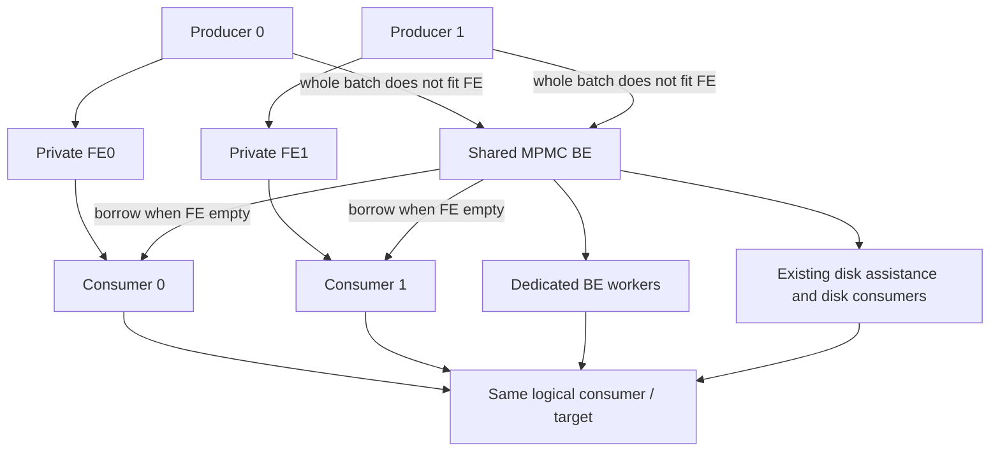
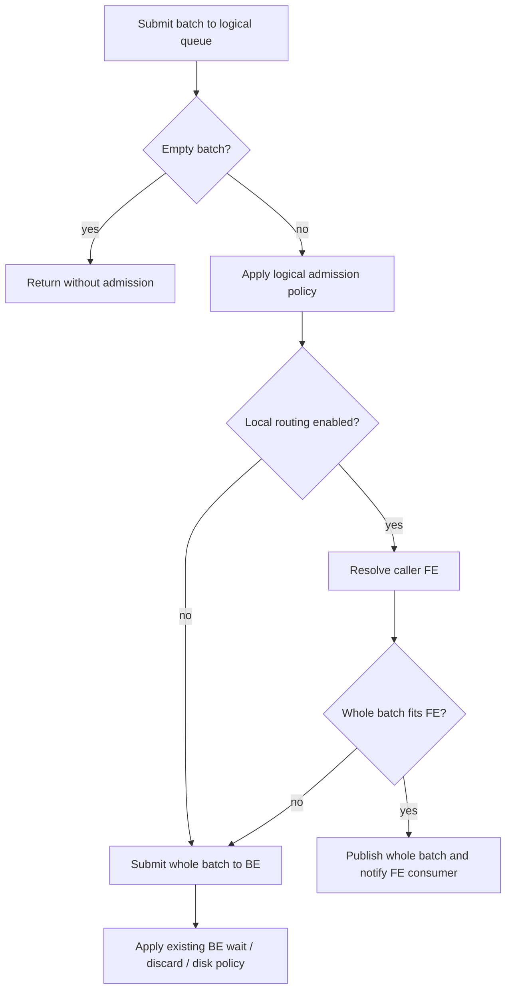
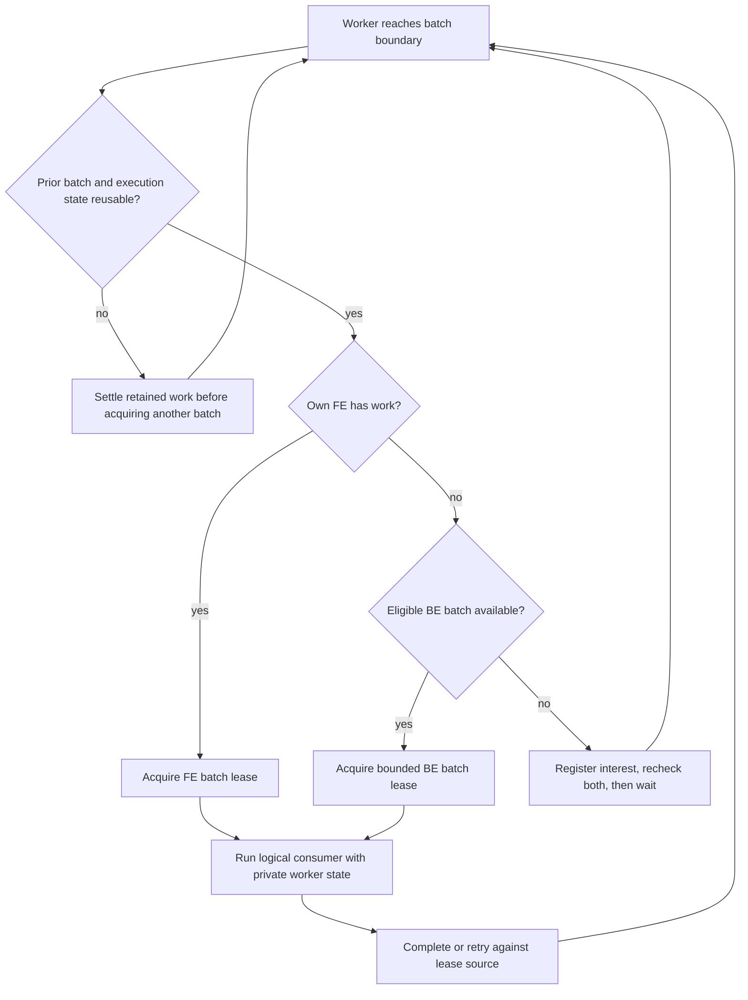
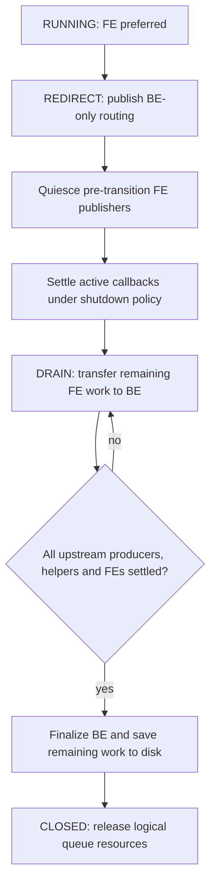
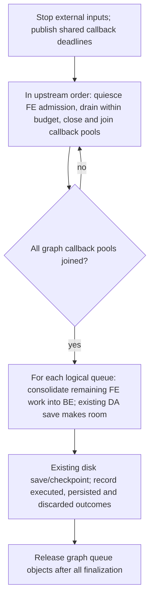
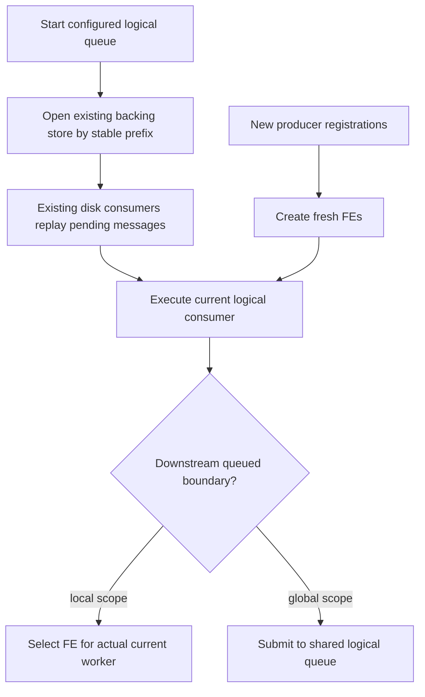

<!--
.. meta::
   :description: Upcoming design for private SPSC front ends, shared MPMC overflow, and disk assistance within one logical rsyslog queue.
   :keywords: rsyslog, queue, local scope, SPSC, MPMC, contention, upcoming work, shutdown, recovery
-->

# Local queue front ends with shared overflow

| Metadata | Value |
|---|---|
| Status | **S0–S6 implemented; bounded S7 closeout complete; qualification limits recorded** |
| Created / last reviewed | 2026-09-14 / 2026-09-15 |
| Audience | Maintainers, implementers, human reviewers, AI agents |
| Code baseline | `b0d9f971f007f06db3f734543cef5dfb312c5090` |
| Source inspection | Core paths first inspected at `82af24be1b1fea24feca2831b236ef6346639364`; the core files cited below are unchanged between these revisions |
| Scope | Architecture and implementation history; measured screens in the target measurement method |
| Configuration status | Current experimental behavior is documented in the [queue reference](../../source/rainerscript/queue_parameters.rst) and [operator guide](../../source/concepts/queues.rst). S0 restrictions below describe the historical MVP; S4–S6 extensions and S7 scope are recorded in the [execution ledger](local-queue-execution-ledger.md) |

<!-- .. summary-start -->
One logical queue gains private single-producer/single-consumer (SPSC) memory
front ends, while retaining the existing shared multiple-producer/multiple-consumer
(MPMC) memory queue and its disk assistance. A producer submits a whole batch to
its front end if it fits, otherwise directly to the shared back end. Front-end
consumers process locally and help the back end when locally idle. Shutdown
consolidates outstanding front-end work into the back end; restart does not
reconstruct the old producer topology.
<!-- .. summary-end -->

The [execution ledger](local-queue-execution-ledger.md) identifies implemented
scope and validation. S3 adds bounded memory-BE helping to S2. S4 adds local
queued actions/rulesets, static acyclic graphs, dependency-order memory shutdown,
and omfwd/omelasticsearch consumer compatibility. S5 integrates existing classic
and segmented disk assistance, shutdown persistence and topology-changing
restart. These stages are not a production performance qualification claim.

The experimental `queue.local.helperBatchSize` parameter defaults to the allocated
FE dequeue limit (`min(queue.dequeueBatchSize, queue.local.frontendSize)`). An
explicit zero disables helping; a positive value must not exceed that limit.
Helpers take available partial batches without waiting to fill the limit and
recheck FE before another borrow. S4 extends the original S0 configuration
restrictions for memory queue graphs and tested outputs. Borrowing preserves the worker's
existing action state, including suspension timers. Routing to BE does not imply
execution by a dedicated BE worker or by a worker with fresh action state. Tests
that require those identities must establish them explicitly or disable helping.

S3 exposes family and optional per-FE `help.attempts`, `help.empty`,
`batch.help.count`, `batch.help.messages.sum`, `batch.help.messages.max`,
`batch.help.limit`, `inflight.help`, `retry.help`, `terminal.help`, `help.completed`,
`help.returned`, `help.waits`, `help.wakes`, `wake.fe`, and `wake.shutdown`.
Borrowing is not new ingress or an FE-to-BE transfer. Completed borrowed messages
split into terminal retirement and returned BE work; unresolved obligations stay
source-bound. `inflight.help` counts messages, not extra workers. Notification
counts describe software notifications, not observed operating-system wakeups.

The companion [implementation plan](local-queue-implementation-plan.md) defines
stages from an experimental MVP through full initial qualification, with
correctness and performance gates after each stage. The
[related-work synthesis](local-queue-related-work.md) records primary-source
precedents, their limits, and implementation lessons.

## 1. Reading and decision conventions

This document is a proposed contract for upcoming implementation work. It must
not be cited as a description of current runtime behavior. It records the design
agreed in the discussion and explicitly separates details still requiring design
or measurement. No implementation, commit, deployment, or performance acceptance
is implied by this document.

- **Agreed:** direction established in the design discussion.
- **Required:** an invariant an implementation must satisfy for this proposal.
- **Proposed:** a concrete implementation choice offered for review.
- **Open:** an unresolved choice; do not silently invent a default in code.

The pseudocode specifies ownership and routing, not a compilable API. Every
symbol introduced there is conceptual unless explicitly identified as existing.
Future revisions should retain decision IDs and update the open-decision table.

## 2. Core idea: one logical queue, three internal tiers

**Agreed:** FE, BE, and disk are internal tiers of one logical queue. They are
not separately configured action destinations or independent delivery requests.
A transfer between tiers moves responsibility for the same pending delivery.

| Term | Meaning |
|---|---|
| Logical queue | One configured main queue, queued ruleset, or action queue and its consumer contract |
| FE | Small private SPSC memory front end selected by producing worker |
| BE | Shared memory back end using the existing MPMC queue machinery |
| Disk | Existing disk-assisted backing store and its consumer machinery |
| FE consumer | Dedicated worker that reads its FE and may borrow work from BE |
| BE consumer | Dedicated worker providing BE scheduling capacity, not unconditional completion progress |
| Producer identity | Stable registration for an actual submitting execution thread during its lifetime |
| Batch lease | Conceptual record identifying the store owning a dequeued batch and its completion obligations |



The normal delivery path bypasses BE. This is not a staging ring through which
all messages must pass before entering MPMC. Conversely, overflow is submitted
directly to BE; it is not first published to FE and then copied out.

The CPU-cache analogy is private L1 / shared last-level cache / main memory:
locality first, shared capacity second, expensive capacity last. It is an analogy
only. Messages carry delivery obligations, not coherent cached copies, and an
output callback may block for an unbounded interval.

## 3. Goals and boundaries

### 3.1 Goals

1. Avoid shared admission, dequeue, and retirement locks for messages processed
   entirely through FE.
2. Preserve efficient producer and consumer batching.
3. Keep FE useful under sustained load: a full FE continues processing while
   excess arrivals use BE; newly available FE capacity is immediately eligible.
4. Reuse idle FE consumers to drain BE during uneven load.
5. Retain existing BE retry, disk assistance, and restart mechanisms where their
   contracts apply.
6. Preserve public producer submission APIs and consumer callback signatures
   where possible, with internal queue/worker changes.
7. Keep the configuration centered on one logical queue and one destination.

### 3.2 Initial restrictions

**Agreed:** start with imtcp ingress, acyclic execution graphs, and accepted
worker growth for the PoC. Supporting imtcp without changing its submission calls
is the target; internal producer registration still needs implementation.
Downstream actions and queued rulesets used in the PoC require explicit coverage.
The imtcp-only restriction does not mean that downstream asynchronous submission
paths can be ignored.

**Proposed:** initially use FixedArray or LinkedList as the BE with disk
assistance exercised separately. Pure disk BE, dynamic reload, arbitrary
submission callbacks, indirect ruleset calls, and other inputs require explicit
support decisions before being enabled. Acyclicity validation must reject paths
whose behavior cannot be established, rather than silently accepting cycles.

### 3.3 Non-goals

- Exactly-once delivery or global FIFO completion.
- Transferring an executing module callback or live connection to another worker.
- Resumable RainerScript execution or replaying an entire script after an action
  fails.
- Solving remote endpoint saturation or automatically scaling worker count.
- Eliminating BE synchronization or rewriting disk formats.
- New power-loss guarantees. Graceful shutdown and restart are in scope;
  power-loss/checkpoint tuning follows separately without weakening existing
  configured guarantees.

## 4. Relationship to current implementation

The following paths establish what can be reused and where assumptions differ.
Links refer to files; function names are the stable search anchors.

| File / symbol | Current role | Design consequence |
|---|---|---|
| [tools/rsyslogd.c](../../../tools/rsyslogd.c): `submitMsg2`, `multiSubmitMsg2` | Select logical queue and submit one/multiple messages | Keep entry points; route to FE or BE internally |
| [runtime/tcps_sess.c](../../../runtime/tcps_sess.c): message submission, `multiSubmitFlush` | imtcp framing and batched submission | Register actual submitting worker, not listener identity |
| [runtime/queue.c](../../../runtime/queue.c): `qqueueEnqMsg`, `qqueueMultiEnqObjNonDirect` | Shared mutex, admission checks, worker advice | Separate logical admission from physical tier submission |
| [runtime/queue.c](../../../runtime/queue.c): `ConsumerReg` | Dequeue under queue lock, execute consumer unlocked | Preserve unlocked execution; add FE path and explicit batch owner |
| [runtime/queue.c](../../../runtime/queue.c): `DeleteProcessedBatch` | Completion, retry/re-enqueue, retirement | Cannot apply unchanged to FE; consumer re-enqueue would violate SPSC |
| [runtime/queue.c](../../../runtime/queue.c): `StartDA`, `ConsumerDA` | One memory parent, disk child, transfer worker | Reuse behavior, revise ownership and helper integration |
| [runtime/queue.c](../../../runtime/queue.c): `DoSaveOnShutdown`, `qqueueShutdownWorkers` | Join workers and save remaining memory backlog through DA | Extend ordering to all FE owners and producers |
| [runtime/wti.c](../../../runtime/wti.c): `wtiWorker` | Worker loop attached to one owning queue pool | FE worker needs to process a BE lease without becoming a BE worker |
| [runtime/wti.h](../../../runtime/wti.h): `actWrkrInfo_t`, `wti_s` | Private action state, batch, execution state | Keep module state private; distinguish worker identity from batch store |
| [runtime/action.c](../../../runtime/action.c): `doSubmitToActionQ`, `processBatchMain`, `actionCommit` | Direct vs queued execution, transactions and retries | Preserve callback semantics; audit completion and retry paths |
| [runtime/ruleset.c](../../../runtime/ruleset.c): `execCall`, `processBatch` | Synchronous/queued calls and script execution | Downstream local FE belongs to actual calling worker |
| [runtime/msg.c](../../../runtime/msg.c): serialization and `MsgSetRulesetByName` | Persist message data and ruleset association | No producer-thread persistence required |

Current DA disk children execute the same consumer callback as their memory
parent. Startup constructs consumers using current configuration and activates
them for recovered data without needing original producers. These properties
already fit the proposed recovery model.

Current DA ownership is nevertheless not plug-and-play: `pqParent` identifies one
memory parent, parent and disk child share a mutex, and shutdown/accounting assume
that relationship. The logical owner must explicitly coordinate all FEs with BE;
it must not pretend every FE is another ordinary DA parent sharing those pointers.

Current RAM retirement already supports out-of-order worker completion, including
constant-time FixedArray retirement and deferred message destruction. Retain
those BE improvements; do not introduce an ordered retirement frontier.

## 5. Configuration model

**Agreed:** local scope is an option on existing logical queues, not a new storage
type. Global scope preserves current behavior. The activation parameter is fixed
as `queue.scope="local"` for S2 and later stages; `queue.scope="global"` preserves the default.

| Concept | Intended meaning | Status |
|---|---|---|
| Scope global | Existing shared queue behavior | Agreed default |
| Scope local | Private FE per producing worker plus shared BE/disk | Agreed |
| FE capacity | Entries per FE, with 10,000 as the discussion scenario | Numeric default open |
| BE capacity | Existing shared memory capacity; 1,000,000 in the scenario | Proposed interpretation of existing `queue.size` |
| BE worker count | Guaranteed dedicated shared-backlog consumers | Naming and default open |
| Helper batch limit | Maximum BE batch borrowed before rechecking FE | Open |
| FE count / total budget | Bound producer registrations and aggregate memory | Required; mechanism open |

These are not runnable configuration examples. A future implementation must
reject unsupported combinations during configuration validation. Direct queues
retain synchronous execution; local scope should initially be rejected with
Direct rather than implying an asynchronous replacement with identical return
semantics.

A frontend-capacity setting must be distinct from the existing BE size. Before
implementation, resolve whether an additional logical total limit constrains
both or whether documented total capacity is BE plus all FEs and active batches.
Never silently turn a historical queue limit into an unbounded multiplication.

New configuration handling must follow the repository's shared configuration
backend and RainerScript/YAML parity rules. Do not add a frontend-only parser path.

## 6. Logical ownership and invariants

The following invariants are normative for the proposal.

| ID | Invariant |
|---|---|
| I1 | Every accepted delivery obligation has one responsible store or executing batch owner until terminal completion or explicit configured discard. |
| I2 | Each FE has exactly one active producer and one active consumer; maintenance handoff requires prior quiescence. |
| I3 | Whole-batch FE admission publishes all entries or none. Failed FE fit checks consume no message references. |
| I4 | Overflow chooses BE directly; an FE-owned message is not simultaneously an independent BE obligation. |
| I5 | The FE consumer processes its own FE first and checks it again after every bounded BE batch. |
| I6 | Borrowing is limited to the same logical queue and consumer contract. |
| I7 | Borrowed batches complete, retry, and release capacity against their source store, regardless of executing worker. |
| I8 | Module worker instances are never used concurrently by different workers or migrated implicitly. |
| I9 | A full FE alone does not impose producer blocking; BE admission policy decides whether the logical queue must wait or discard. |
| I10 | Logical counters count admission once; tier transfers are not new external arrivals or successful target deliveries. |
| I11 | Sleeping cannot lose either local work or BE work; wakeups are hints and predicates are authoritative. |
| I12 | BE/disk remain available until all upstream FE transfers and producers are finished. |
| I13 | Accepted work remaining solely in FE is not forgotten at graceful shutdown. Failed transfer retains identifiable responsibility or follows an explicit terminal error policy. |
| I14 | Restart does not depend on old worker IDs or reconstruction of old FEs. |
| I15 | FE registration, buffers, batches, and retry holdings are bounded and included in resource accounting. |

“Owner” describes delivery responsibility. Multiple reference-counted pointers
can legitimately exist, including normal fan-out to different logical actions.
Those different action deliveries are distinct obligations; tier transfers within
one logical queue are not.

## 7. Producer registration and FE selection

### 7.1 Identity and lookup

The existing API selects a logical queue. An internal registration then maps
`(logical queue, current producer registration)` to an FE. One imtcp listener can
have several producer workers, so listener identity is insufficient. A TCP
session may be processed by different imtcp workers over time; this design does
not promise session affinity or session ordering.

**Proposed:** use a per-thread cache for registered logical queues and a slow
registration path protected by the logical owner. Avoid a shared registry lock
on every message. Cache entries need generation/lifetime protection so a recycled
thread ID or destroyed queue cannot expose a stale FE pointer. Raw `pthread_t`
values alone are not durable or sufficient lifetime identities.

A submitting thread that calls several logical queues receives a separate FE in
each. Repeated calls reuse registrations. Registration failure and configured
FE-count exhaustion need an explicit policy: proposed fallback to BE when safe,
with counters; never silently exceed the bound. Unsupported producer contexts
must be rejected or explicitly routed through a documented fallback path.

### 7.2 Producer exit

Producer exit closes its FE for further producer publication but does not destroy
queued work or the consumer's active batch. The logical owner keeps the FE alive
until its work has completed or moved to BE. Removal must invalidate caches safely
and not race shutdown enumeration. Dynamic worker replacement is an explicit
lifecycle test even if imtcp workers normally live for the process lifetime.

## 8. Whole-batch enqueue algorithm



The fit predicate is the routing decision. It does not inspect endpoint health,
consumer heartbeat, suspension state, or elapsed callback time. Ordinary fullness
does not set a persistent fallback mode.

```text
submit(queue, batch):
    if batch is empty: return
    establish logical admission and exact reference ownership
    enter a lifetime-safe producer routing section
    if local routing is enabled and this caller has an eligible FE:
        if FE has usable room for the entire batch:
            initialize entries
            publish the batch once
            notify consumer if required by the wake protocol
            leave routing section
            return accepted
    leave routing section after selecting a live BE destination
    submit entire batch through BE admission
    propagate the existing API's documented outcome/ownership behavior
```

This pseudocode does not assume existing BE multi-enqueue is transactional.
Routing selects one tier for the whole batch; within BE, existing per-message
admission/discard behavior may still apply. Audit actual return-value and
reference-consumption contracts before writing the wrapper. Single-message
submission uses the same policy with a batch of one.

An FE may have available slots but fail a required logical budget reservation.
That is an admission-policy issue, not permission to exceed bounds. Such limits
must be resolved before the fast path is called correct. Once capacity and
admission are granted, only the single producer can consume the observed FE free
space; the consumer can increase it. A shutdown routing transition must still
synchronize with publication (Section 15).

### 8.1 Existing batching contracts: actual counts, not fixed blocks

Source inspection on 2026-09-14 confirms several different batching layers. They
must not be collapsed into a single fixed-size unit in the FE implementation.

| Layer | Current behavior | FE/BE requirement |
|---|---|---|
| Producer submission | `multi_submit_t.nElem` is the actual count; `maxElem` is capacity. imtcp's `DataRcvdUncompressed` uses capacity 1024 and flushes the residual at the end of the received-data call. Rate-limit submission flushes at capacity and can flush early before an oversized message. | Test fit against actual submitted count, never capacity or configured dequeue maximum. |
| Queue consumption | `DequeueConsumableElements` builds up to `iDeqBatchSize` from available messages; ordinary memory dequeue does not require that maximum to be reached. Explicit minimum-batch settings add their own waiting/timeout behavior. | FE and BE helper reads return available partial batches up to their limits. No implicit wait to fill a maximum. |
| Downstream queued action | `doSubmitToActionQ` uses single-message `qqueueEnqMsg` calls even while a ruleset worker is executing a larger batch. | Such submissions have routing size one; the downstream consumer may coalesce them into its own batch. |
| Ruleset and action execution | Ruleset processing visits messages individually and commits accumulated Direct transactions; action queue processing prepares individual messages then commits. Filters, repeated action calls, errors and module behavior affect action work. | Producer batch, dequeue batch and action transaction sizes need not match. |
| Output wire request | For example, omelasticsearch can flush before `maxbytes` is exceeded and flush remaining work in `endTransaction`; its return codes distinguish deferred/current and previous committed work. | Do not equate a queue batch with one network request or one all-or-none successful transaction. |

Additional source anchors are `runtime/ratelimit.c:ratelimitSubmitCheckedMsg`,
`tools/rsyslogd.c:multiSubmitFlush`, `runtime/wti.c:wtiNewIParam`, and
`plugins/omelasticsearch/omelasticsearch.c:doAction/endTransaction`.

**Required:** whole-batch routing is only an admission/publication decision. It
does not preserve producer batch boundaries in storage. An FE pointer ring may
split one submitted group across successive dequeue batches or coalesce entries
from several submissions. It must publish each submitted group safely before the
consumer reads it, but must not retain the producer's temporary pointer array.

For example, a configured producer buffer capacity of 1024 containing 37 messages
needs 37 FE slots. A dequeue maximum of 128 can return those 37 immediately under
ordinary settings, or coalesce them with other available messages. A helper limit
of 64 is a ceiling, not a request to wait until BE contains 64 messages.

Completion must use the actual batch fields: `maxElem` is allocated capacity,
`nElem` is populated count, `nElemDeq` is store-retirement count, and `eltState`
contains individual outcomes. Discard and disk-recovery handling can make these
counts differ. Never complete or destroy `maxElem` entries merely because that was
the allocation. `wtiResetExecState` also distinguishes a one-message batch in its
auto-commit flag, so singleton/multi-message paths both need coverage.

Minimum-dequeue-batch options are an explicit compatibility gate: decide whether
their waiting applies per FE or logical queue and how it interacts with helper
selection and its smaller ceiling. Initially reject unsupported nondefault
minimum settings rather than silently imposing waits, mixing FE/BE leases, or
changing their meaning. Disk backend batching must be inspected independently;
do not infer its exact waiting behavior from the ordinary memory loop.

### 8.2 Mutation boundaries and target-preferred batching

Single-message asynchronous submission is not to be treated as an incidental
missing multi-submit optimization. Ruleset execution visits a message through
branches and stages that can mutate it. Submission occurs at that particular
execution boundary, using the existing reference/copy semantics, so downstream
work can execute in parallel. Collecting submissions until the end of an upstream
batch can change the observed message state, reference lifetime, error visibility,
or execution timing. Do not introduce such accumulation without a separate
semantic analysis and tests. A reference alone does not freeze message contents.

Consumer-side batching is separate: a downstream worker may collect messages that
have already been submitted into a batch appropriate for its target. This is not
SIMD execution. Messages in one queue batch can follow different branches, mutate
differently, select different actions and have different completion outcomes.
An action transaction is not a guarantee of uniform execution or rollback.

Some targets benefit from deliberate accumulation to avoid small requests, for
example Elasticsearch bulk output. Preserve explicitly configured minimum/preferred
batch and timeout behavior when supported; ordinary no-minimum operation still
must not wait to reach a maximum. The design is neither fixed-size batching nor
unconditional immediate flush. Target preferences, dequeue ceilings and module
byte limits must be reconciled explicitly, not conflated into one size.

Partitioning can reduce effective batch size per consumer despite high aggregate
throughput. That can raise request rate, CPU, connection overhead and downstream
load enough to offset synchronization savings. S0 must determine how target-aware
batch accumulation interacts with local FE selection, helper ceilings, and local
latency. A helper cap smaller than a configured minimum cannot be accepted with
silently changed semantics. Initial rejection of unsupported minimum settings is
acceptable only as an explicit MVP restriction, not full-feature support.

Measure actual output-request message and byte distributions alongside submission
and dequeue distributions. Exercise mixed mutation paths and destination selection,
short batches and singleton submission, explicit minimum-batch timeout, module
partial bulk flushes, and a shared BE containing work while a local consumer is
waiting to accumulate its preferred batch. Accumulation does not authorize BE
helping: acquisition still requires an empty FE and no retained batch or execution
state preventing reuse. A nonempty FE waiting for its minimum remains ineligible;
an already acquired short batch cannot be supplemented with a different source
lease merely to reach a target size. Serving BE while a nonempty FE accumulates
would require an explicit scheduling-policy revision with ownership and priority
tests. S0/S4 must resolve supported accumulation settings within these constraints.

## 9. Sustained overflow: the 10K / 1M scenario

Assume an FE with 10,000 usable entries and a shared BE with capacity 1,000,000.
FE is full when another producer batch of 1,000 arrives. That batch goes directly
to BE. The FE consumer continues processing its existing messages through the
fast path. If it frees 1,000 slots before another batch of 1,000 arrives, the new
batch can enter FE.

There is no requirement to drain BE before FE admission resumes, and no rule
switching the entire producer permanently to BE after one overflow.

At steady state, if a producer offers rate `lambda` and its FE consumer sustains
local processing rate `mu_FE`, the local path can carry roughly `mu_FE`, with
excess `max(0, lambda - mu_FE)` offered to BE. This is explanatory arithmetic,
not a performance prediction: actual rates depend on batching, scheduling,
shared endpoint resources, admission policies, and helper work.

A producer batch larger than FE usable capacity always goes to BE. A batch that
does not fit is not split to fill the remaining FE slots. This deliberately
trades some instantaneous space utilization for batching and simpler ownership.

## 10. Consumer scheduling and BE helping



**Agreed:** FE consumers help BE only when their own FE is empty. Each helper
rechecks FE after one bounded borrowed batch. Borrowing is ordinary MPMC dequeue,
not removal from another SPSC. The BE batch is executed directly; it is not
preloaded into the helper's FE, which would introduce another FE producer.

An empty FE ring is necessary but not sufficient for helping. The worker must
also have no unresolved batch, completion context, or action transaction that
prevents safe reuse of its execution state. Retained retry work must be settled
before acquiring another batch unless an independently reviewed representation
proves safe separation. This applies to acquisition from FE as well as BE.

**Proposed:** retain a small dedicated BE pool to supply scheduling capacity when
all FEs remain busy. Completion progress still depends on a runnable consumer and
progressing target/storage; all dedicated workers can themselves block. Exact
worker counts and helper batch limits require measurement. Do not automatically
scale total workers in this first design.

A borrowed batch introduces ownership separate from worker identity. Conceptually:

```text
lease = { source_store, logical_queue, batch, completion_context }
execute(logical_queue.consumer, batch, current_worker)
finish_or_retry(lease.source_store, lease, current_worker)
```

Current `wti_t` and `wtp_t` bind workers to one queue and its mutex, callbacks,
shutdown state, and batch bookkeeping. Calling an existing BE worker loop with
an FE worker pointer is not a safe implementation shortcut. Extract or adapt the
batch acquisition/completion seam, including cleanup and cancellation paths.

### 10.1 Disk interaction

Initial helpers borrow memory-BE work only. Existing disk consumers retain disk
store completion, retry, and checkpoint ownership. Helpers must not bypass the
BE/DA arbitration that decides which memory work is available to ordinary
consumers and which is being transferred to disk. Whether helpers later consume
disk leases is a separate extension.

### 10.2 Latency and fairness

A newly arriving FE batch can wait behind a borrowed BE batch. Bound the borrowed
message count and recheck FE between batches, but do not claim a wall-clock bound:
a target callback can block. Large batches improve amortization but can hoard BE
work and worsen local tail latency. Track BE oldest age as well as occupancy.
Dedicated BE capacity prevents starvation caused solely by strict local
preference; it does not guarantee progress through blocked output callbacks.

## 11. Output execution, suspension, and retries

FE and BE consumers call the same logical consumer using independent worker
instances. Direct actions and synchronous ruleset calls execute on the current
consumer. A downstream locally scoped queue resolves an FE for that actual
worker, including BE and disk consumers. A downstream global queue intentionally
merges callers. Thus local scope can form a forest of fast paths, but shared BE
and disk paths are intentional internal convergence points.

A blocked FE consumer retains its active callback and module state. Its producer
can continue filling FE, then route batches to BE when they do not fit. No
suspension notification is necessary for enqueue correctness. Backpressure
ultimately comes from logical queue/BE/disk limits, not local fullness alone.

A stalled connection does not prove that all remote targets are saturated.
Other workers may progress. Conversely, FE and BE workers may contend for one
remote bottleneck or shared output lock; extra workers do not create destination
capacity. This is the same underlying limitation as current queued execution.

### 11.1 Unresolved FE batches

Current queue completion can re-enqueue unresolved messages. An FE consumer must
not re-enqueue into its own SPSC producer end. The implementation must choose an
explicit policy before enabling failure tests:

- retain the unresolved batch as consumer-owned work, with bounded retry and
  shutdown handling; or
- transfer safely retryable message obligations to BE after the callback has
  returned and completion state is known.

**Proposed first approach:** retain ordinary worker-local retry execution and
active module state; use BE transfer only at a verified message/batch ownership
boundary. Do not infer that `SUSPENDED` means an active transaction can be
serialized and recreated on another worker without further analysis.

Transactional outputs can retain partial output, rendered parameters, and
connection buffers. `actionCommit`, batch state transitions, permanent errors,
retry exhaustion, and cancellation require an explicit audit. Disk stores persist
messages, not arbitrary module execution stacks. Preserve existing delivery and
duplicate-risk semantics rather than claiming stronger guarantees.

## 12. SPSC storage, synchronization, and wakeups

**Proposed:** bounded pointer rings with batch publication, producer/consumer
indices on separate cache lines, and acquire/release operations appropriate to
the supported C memory model and platforms. Define whether allocation includes
an unused sentinel slot so configured capacity means usable message entries.
Counter wraparound, allocation overflow, and non-power-of-two requested sizes
must be handled explicitly.

Required publication ordering:

1. Producer obtains space and initializes all batch entries.
2. Producer publishes the new write position with release semantics.
3. Consumer observes that position with acquire semantics before reading entries.
4. Consumer publishes reusable slots only after taking independent ownership of
   their message references.
5. Producer acquires the consumer position before reusing those slots.

Reusing a slot is not equivalent to finishing a delivery. Active and retry batches
remain accounted for after removal from the ring. Destruction and shutdown must
not inspect stale ring entries as independently owned messages.

### 12.1 Sleep protocol requirements

An FE consumer can wait on both local and shared work. A correct protocol must
cover publication before waiter registration, publication during recheck, BE
arrival after local-empty observation, and shutdown during sleep registration.
The protocol should register interest, recheck predicates, and only then park
using synchronization that prevents a notification from being lost between the
recheck and park.

The exact primitive is open. A shared condition variable on every FE publication
would risk recreating hot-path contention. Proposed direction: per-worker local
notification plus a BE-side registry of idle eligible helpers; modify that shared
registry only on idle/active transitions. Wake a bounded useful number of helpers
for BE arrivals instead of broadcasting to all workers.

The prior rejected waiter-targeting experiments are not an approved implementation
recipe. Consult [rejected paths](../rejected_engineering_paths.md) and measure any
new wake policy in this different topology. Correctness comes before suppression
of apparently redundant wakeups.

### 12.2 Producer admission wakeups

Consumer wakeups are only half of the progress contract. If admission uses a
logical capacity limit or shared credits, a producer blocked on that predicate
must be notified when FE completion, BE completion, credit reclamation, producer
retirement, or shutdown changes its eligibility. FE-only progress must suffice;
there may be no later BE event to wake the producer.

Current `doEnqSingleObj` waits on queue-full and watermark conditions, and
`DequeueConsumable` supplies corresponding notifications. A new FE path bypasses
that machinery and must replace the relationship where appropriate to the chosen
O2 accounting model. Define the predicate, protecting synchronization, all release
sites, notification rule, and shutdown escape. Test that a blocked submission
becomes admissible solely through FE completion, without further arrivals or BE
activity. A timeout/discard in that case is not an acceptable substitute for wakeup.

## 13. Memory, admission, and statistics

### 13.1 Capacity is more than ring slots

With `P` fronts of usable capacity `F`, BE capacity `B`, and bounded active/retry
holdings `H`, outstanding memory obligations can approach `P*F + B + H` before
considering disk and module buffers. Message payloads, structured properties,
rendered parameters, duplicate snapshots, thread stacks, and ring pointers all
contribute to resident memory.

The 10K FE / 1M BE scenario is not a byte limit. For 100 producers, FE alone adds
one million pointer slots and potentially one million message holdings. Validate
resource multiplication at configuration/registration time and expose it in
statistics. Worker growth is accepted for the PoC but must not mean unbounded
registration or unchecked allocation.

### 13.2 Admission policy must remain logical

Current queue admission includes flow-control classes, enqueue timeout, discard
severity/watermarks, sampling, and shutdown conditions. FE success must not silently
bypass policies that are defined for the logical queue. Classify every existing
option as logical, tier-specific, unsupported, or requiring adaptation.

This is an implementation gate. A single exact shared atomic increment per
message may itself become a bottleneck. Options include bounded credit allocation
in chunks to FEs, or explicitly documented per-tier limits with an aggregate bound.
Approximate statistics are acceptable; approximate accounting that exceeds a
promised hard limit is not. Credit schemes must account for stranded credits,
producer exit, allocation failure, and shutdown.

### 13.3 impstats contract: logical queue and individual fronts

**Required:** integrate with existing `statsobj`/impstats, including useful
individual-FE statistics. Counters are part of the MVP, not a final optimization
instrument. The following field names are proposals for S0 review, not available
configuration or committed public names. Map them to existing naming/reset
conventions and document the mapping before implementation.

Current `enqueued` and `size.enqueued` in `doEnqSingleObj` count arrival attempts
before discard checks. Do not silently redefine them as accepted deliveries.
Current queue `size` includes storage/accounting semantics beyond merely available
ring slots. Keep legacy BE/disk statistics available, identify their physical-tier
scope, and provide a separate logical view with explicit meanings. Backend retry
or transfer counters cannot simply be summed into external ingress counters.

#### Logical identity and inventory

Publish a logical queue identity linking BE/disk objects and FE objects. Each FE
record includes logical queue ID/name, a registration ID and generation, lifecycle
state, producer identity for diagnostics, and consumer identity. Do not expose raw
pointers as identities. IDs are process-lifetime diagnostics, not persistent spool
keys; thread ID reuse must not make two registrations look like one.

Bound FE record cardinality by the registration limit. Individual live-FE records
must be obtainable when FE detail is enabled; aggregate-only or top-N output is not
a substitute when investigating a particular stalled or overloaded front. Provide
a summary default and configurable per-FE detail to control output volume. Publish
terminal registration totals into retired aggregates exactly once before removing
an FE, so churn cannot erase history or double count a final sample. State whether
a final per-FE record is available and how its lifecycle generation is identified.

#### Logical summary metrics

| Proposed field/group | Kind / unit | Meaning |
|---|---|---|
| `ingress.messages`, `ingress.batches`, `ingress.raw_bytes` | Counters | External submission attempts, counted once at logical admission; raw bytes are not heap usage |
| `accepted.messages`, `rejected.messages` | Counters | Admission results; distinguish pre-admission rejection from later configured discard |
| `route.fe.messages/batches`, `route.be.messages/batches` | Counters | Selected tier for external submissions, including singleton batches; selection is not BE acceptance |
| `route.be.reason.*` | Counters by bounded reason | No-fit, oversized batch, registration fallback, shutdown redirect, other explicitly supported contexts |
| `outstanding.messages` | Gauge | Accepted unresolved delivery obligations across FE, BE, disk, active and retry holdings, counted once |
| `terminal.*` | Counters by outcome | Consumer success under its callback contract, permanent failure, configured discard; not inferred remote acknowledgement |
| `fe.live`, `fe.retiring`, `fe.registrations`, `fe.registration_failures` | Gauges/counters | Lifecycle and resource pressure |
| `workers.fe`, `workers.be`, `workers.disk`, `helpers.active` | Gauges | Actual execution capacity by role; helper role must not count a worker twice in total |
| `capacity.*`, `credits.*` | Gauges | Configured/reserved/used local and shared budgets plus stranded credits where applicable |
| `transfer.*` | Counters by source/destination/outcome | Runtime/shutdown movement, explicitly excluded from external ingress |
| `admission.waits`, `admission.wait_ns`, `admission.timeouts` | Counters | Logical producer backpressure, including FE-only capacity release notifications |

Do not call callback success an Elasticsearch indexing acknowledgement or an omfwd
remote durable receipt unless the module contract supplies that evidence. Retries
can produce multiple processing attempts for one outstanding logical obligation.

#### Per-FE metrics

| Proposed field/group | Kind / unit | Meaning |
|---|---|---|
| `capacity`, `queued`, `queued.peak`, `free` | Gauges/peak, message slots | Ring inventory distinct from active batches; effective usable capacity is explicit |
| `inflight.fe`, `retry.fe` | Gauges, messages | FE-source work no longer in the ring; categories must be disjoint |
| `admitted.messages/batches`, `overflow.messages/batches` | Counters | Actual local acceptance and producer batches diverted due to fit; exclude other routing reasons |
| `overflow.oversized_batches` | Counter | Submitted count exceeds this FE's usable capacity |
| `processed.local.messages/batches`, `processed.be.messages/batches` | Counters | Completed processing attempts by source; document terminal versus retried outcomes separately |
| `borrow.attempts`, `borrow.empty`, `borrow.messages/batches` | Counters | Helper activity and unsuccessful shared lookups |
| `batch.submit.*`, `batch.fe_dequeue.*`, `batch.be_lease.*` | Count/sum/max and optional buckets | Actual sizes, not configured limits; zero/idle callbacks do not inflate message-batch counts |
| `batch.waits`, `batch.wait_ns`, `batch.timeout_flushes` | Counters | Explicit accumulation policy cost and partial flushes |
| `idle.waits`, `wake.local`, `wake.be`, `wake.shutdown` | Counters | Sleep/notification events, not assumed one-to-one wake-to-batch correspondence |
| `callback.active`, `callback.source`, `callback.age` | Gauge/state/duration | Current FE/BE execution; useful when output blocks without returning suspension |
| `suspend/retry.*` | Counters/state if exposed | Known callback/worker state only; do not infer suspension from queue occupancy |
| `shutdown.transferred`, `shutdown.transfer_failures`, `shutdown.remaining` | Counters/gauge | FE consolidation and unresolved ownership at shutdown |
| `oldest.queued_age`, `last.progress_age` | Optional sampled durations | Local backlog and progress diagnosis, with defined observation accuracy |

FE counters must expose local and borrowed work separately; an apparently idle FE
ring can belong to a consumer busy on BE. Callback age is diagnostic, not a new
stall-based routing predicate. Backlog age in a ring requires a safe metadata
snapshot, not dereferencing a head message concurrently with its destruction.

#### BE, disk and target statistics

Retain existing BE/disk occupancy, disk usage, spill, replay, retry and contention
information, linked to the logical identity. Add source attribution for external
overflow, FE shutdown transfers, and internal retries where missing. Expose BE
oldest queued age and source-tagged in-flight work, and distinguish dedicated BE
consumption from FE helpers. Optional mutex diagnostics must remain optional;
timing every lock can change the workload being measured.

For target batching, use existing module metrics or the test receiver where
available; add supported module instrumentation only when necessary. Required
benchmark evidence includes request count, messages/request, bytes/request,
partial flush reasons, retries and success outcomes. Generic queue code cannot
claim to know module wire-request boundaries from dequeue batch size alone.

#### Consistency, reset, and cost

At a quiescent verified point, for one logical queue with opening recovered
obligations `R`, newly accepted obligations `A`, terminal outcomes `T`, and remaining
obligations `U`, require `R + A = T + U`. Tier transfers change location only.
Define counters for epochs so periodic reset or restart does not invalidate this
identity. Disjoint outstanding categories include ring/store waiting, executing,
retained retry, and any ownership-transfer interval; a reference shared during
handoff must not be counted as two obligations.

Live aggregate snapshots need not be globally atomic. Document their bounded
observation/staleness properties; transient mismatches are not automatic loss
findings. Tests use barriers/quiescence for exact reconciliation. Gauge sampling
must remain memory-safe during FE removal. Resettable counters follow the existing
stats contract; monotonic counters plus collector deltas are preferred internally
where they avoid a collector reset racing single-writer updates. Final reset and
retirement semantics are an S0 decision, with deterministic tests.

Use single-writer, cache-isolated counters with safe atomic/snapshot publication;
plain racy reads are not permitted. Aggregate at collection time or bounded
intervals, not under a global lock for every FE message. Basic counts and gauges
must be available cheaply. Detailed latency buckets, callback clocks and profiling
may be sampled/opt-in with explicit sampling rates and units. Compare disabled,
summary, and per-FE detailed impstats modes at matched reporting intervals. Ensure
the stats output path cannot create recursive FE registration or an impstats
feedback storm in the measured pipeline.

## 14. Ordering and externally visible semantics

**Agreed:** reordering is accepted. Existing multi-consumer queues already allow
out-of-order completion; concurrent FE/BE execution adds additional overtaking
and can increase its distance. There is no FE/BE ordering barrier.

This is a change for users relying on one current consumer. Enabling local scope
can create several target consumers even when dedicated BE worker count is one.
Configuration documentation must distinguish total consumers from BE workers and
must not promise single-consumer ordering.

Asynchronous enqueue reports the existing queue API's admission outcome, not the
eventual target result. `previous_action_suspended()` and failure-dependent action
chains retain queued rather than Direct semantics. Do not advertise local scope
as a semantically transparent Direct replacement.

Message reference and snapshot behavior follows the logical consumer boundary.
Do not assume a reference-count increment freezes later message mutations.
Audit existing action copy settings and queued ruleset duplication. Shared action
resources may still serialize execution even with perfectly private FE queues.

## 15. Graceful shutdown state machine



### 15.1 Transition and producer races

**Agreed:** shutdown switches routing to BE and drains FE contents there. A simple
unsynchronized boolean is insufficient. A producer can read RUNNING, be delayed,
and publish to FE after shutdown believes it is drained.

Required ordering: publish REDIRECT, then establish that all pre-transition
producer routing sections have exited or account explicitly for their later
publication, before declaring any FE drained. Registration must also stop or
create BE-only routes during this phase. The implementation may use producer
quiescence, generation acknowledgement, or another proven protocol; avoid placing
an expensive global lock on every normal enqueue merely for shutdown convenience.

### 15.2 Draining and consumer ownership

Normally the FE consumer finishes its current callback and transfers its remaining
FE messages to BE instead of executing them. New FE borrowing stops during drain.
A BE batch already borrowed must complete or be returned through BE's own cleanup
contract before the helper terminates.

If a callback does not return, use the existing action-shutdown/cancellation policy
with an audited cleanup path. A replacement drainer may read FE only after the
original consumer has stopped and been joined, with active-batch responsibility
reconciled. Never introduce a concurrent second FE consumer during cleanup.

Transfer through an API with explicit ownership on every outcome. BE enqueue can
wait, discard, or fail under existing policies; successful function return must
not be assumed to mean durable retention without checking that API's contract.
The implementation must either reserve/ensure transfer capacity, retain rejected
obligations for a documented retry/error path, or explicitly report configured
loss. Never decrement FE outstanding responsibility before the receiving outcome
is known. Define behavior for disk-full and shutdown deadline exhaustion.

### 15.3 Graph-wide ordering

S5 separates callback shutdown from final persistence:



The execution graph is initially acyclic. Stop external input, then quiesce and
drain logical queues in an order that keeps downstream queues available while
upstream consumers can still submit. Recovery workers and helpers are producers
of downstream queues too. New local registrations during drain must not escape
shutdown enumeration. Do not multiply an intended logical shutdown deadline by
the number of FEs without an explicit policy.

The shared graceful/action deadlines govern callback execution. They do not
introduce a new timeout for persistence: the existing `DoSaveOnShutdown` phase
may continue past them while the DA transfer worker saves pending memory work.
FE consolidation covered by save-on-shutdown must preserve that same distinction,
rather than discarding work solely because an action deadline expired.

Only after all FE obligations and upstream submissions are settled may BE run its
final save/close phase. Existing DA transfer and disk consumer shutdown must be
coordinated rather than bypassed. Empty rings alone do not prove shutdown complete.

Existing `ruleset.c:destructAllActions` enumerates configured rulesets; that is not
a topological shutdown mechanism. Existing DA shutdown also stops transfer and
sets enqueue-only states. The implementation must not enter those stages while
FE consolidation still needs downstream consumption or disk transfer to free
capacity. Produce an explicit queue dependency, activation, and shutdown inventory,
including helper and recovery-worker submissions. Validate a queued-ruleset chain
whose declaration order is the reverse of its dependency order, with full
downstream BE, pending FE work, and active DA transfer. The oracle is settlement
of every upstream obligation while the necessary downstream paths remain usable,
within the defined logical deadline.

## 16. Restart and recovery



**Agreed:** old FE identities and worker topology are transient. FE-to-BE transfer
consolidates pending messages in the logical queue; it does not itself persist
them. There are three distinct shutdown outcomes:

- Work finishes through the target before shutdown.
- Remaining work is successfully saved using compatible disk assistance and
  `saveOnShutdown` settings, then recovered on restart.
- Remaining memory work is discarded under the configured shutdown policy, or
  a persistence failure is explicitly reported and handled.

The recovery diagram assumes a backing store actually contains saved data.
Current `qqueueDestruct` calls `DoSaveOnShutdown` only when DA is available,
remaining memory work exists, and `bSaveOnShutdown` is set. A memory-only BE, or DA
with save-on-shutdown disabled, does not acquire a stronger restart guarantee by
enabling local scope. Existing disk-resident work follows its existing persistence
contract. Configuration validation and documentation must distinguish these cases.

When pending FE work has been successfully consolidated and persisted, restart
recovers that store without knowing whether the prior process had four, eight,
or no FEs. Power-loss guarantees remain a separate topic.

Action backlogs execute their action. Ruleset backlogs execute their ruleset and
may create downstream local FEs for the recovery worker. These are current
registrations, not reconstruction of the old forest. A second shutdown before
recovery finishes must include those FEs too.

Switching global/local scope or changing producer counts should not require a
new backing-store namespace, provided the logical destination and storage options
remain compatible. Changing or removing the action/ruleset remains an operational
issue already present today: the spool does not recreate historical configuration.
Do not auto-delete unmatched stores or silently promise compatibility with changed
semantics. Exact operator handling is outside the FE performance mechanism.

No strict recovery-before-fresh barrier is proposed. Existing disk and fresh FE
processing may interleave under the accepted reordering policy. If future users
require a stronger barrier, it is a separate behavioral feature.

## 17. Failure and boundary matrix

| Event | Required handling / expected consequence |
|---|---|
| Empty producer batch | No registration required solely for this submission; no counters for messages |
| Batch exactly fits | Publish all entries; verify ring usable-capacity convention |
| Batch one entry too large for current free space | Route entire batch to BE; leave FE contents unchanged |
| Batch exceeds FE maximum | Always BE; no repeated FE resizing |
| FE callback blocks | FE may fill; subsequent non-fitting batches use BE |
| FE callback suspends | Existing active-state handling; no special enqueue health predicate |
| BE also full | Apply documented logical/BE backpressure and discard policy |
| Disk unavailable/full | Existing storage error behavior plus explicit FE transfer outcome; no hidden loss |
| Registration/allocation fails | Bounded, observable fallback or error; no leaked ownership |
| Producer exits with FE backlog | Keep consumer/FE alive until drained or safely transferred |
| Helper is cancelled with a BE batch | BE cleanup receives lease; no FE retirement of BE messages |
| Callback has partial transaction success | Preserve existing status/duplicate semantics; no whole-batch success assumption |
| Shutdown races FE publication | Quiescence protocol includes publication before declaring drain complete |
| Second shutdown during recovery | Include FEs created by disk/recovery workers |
| Memory-only or save-on-shutdown disabled | Preserve documented memory-loss policy; do not claim FE transfer alone provides restart recovery |
| Unsupported cyclic or indirect graph | Reject before activation under initial restrictions |

## 18. Implementation decomposition

These phases are a planning sequence, not authorization to write runtime code.
Each should produce reviewable evidence before subsequent optimization.

### Phase A: contracts and inventory

- Resolve admission/size semantics, configuration names, supported options, and
  total worker limits.
- Inventory all submission paths in the supported imtcp-to-output graph, including
  single/multi-submit, queued ruleset calls, re-injection, retries, and diagnostics.
- Document exact message-reference consumption and partial outcomes of current APIs.
- Map worker shutdown, cancellation, action transactions, and DA arbitration.
- Produce the queue dependency/activation/shutdown inventory, including reverse
  declaration order and capacity dependencies; specify producer admission wakeups.
- Define queue-family owner and batch-lease contracts with lock ordering.

**Exit:** no unidentified producer or completion path in the supported graph;
open decisions affecting correctness have concrete answers.

### Phase B: FE storage and routing

- Add opt-in configuration and per-producer registration behind existing APIs.
- Implement bounded SPSC batch publication and consumer ownership.
- Add direct-to-BE overflow and keep global scope unchanged.
- Establish logical accounting without hot-path shared serialization.
- Use a diagnostic consumer to prove IDs and lifetime before testing network outputs.

**Exit:** fit/overflow, wraparound, ownership, registration and quiescence tests pass.

### Phase C: execution and BE helping

- Integrate worker-private consumer state and source-tagged batch completion.
- Add bounded BE borrowing without changing FE single-consumer ownership.
- Implement and test dual-source waiting and guaranteed BE service.
- Validate representative transactional and nontransactional output behavior.

**Exit:** uneven-load tests prove helpers make progress and return to local work;
retry/cancellation completion always reaches the correct store.

### Phase D: disk and lifecycle

- Coordinate the logical owner with existing BE/DA machinery.
- Implement REDIRECT, FE draining, helper cleanup, and final BE persistence.
- Validate changed worker count/scope restart and shutdown during recovery.
- Check capacity failure and timeout handling, not only clean empty shutdown.

**Exit:** complete message accounting across restart at each queued boundary,
without restoring old FEs or claiming new power-loss guarantees.

### Phase E: performance and integration

- Run equal-resource baseline comparisons, then separately assess intentionally
  expanded worker configurations.
- Tune capacities/helper batch sizes only from evidence.
- Add operator documentation and configuration parity, review API/ABI effects,
  and update current architecture/module metadata only when behavior is implemented.
- Run repository-required concurrency, security, and container validation.

**Exit:** declared performance thresholds and correctness guardrails pass; report
inconclusive results honestly and record rejected experiments in the dated catalog.

## 19. Validation plan and deterministic oracles

New tests belong in the existing `tests/` harness and must explain setup, stimulus,
and success/failure oracle inline. Use explicit barriers/handshakes rather than
sleeping to infer blocked states. Timeouts are hang bounds, not proof of ordering.

| Test | Deterministic oracle |
|---|---|
| Whole-batch fit and overflow | Tier counters and IDs show exact-fit batch wholly in FE and non-fitting batch wholly routed to BE |
| FE 10K plus next 1K | Hold consumer at a barrier, fill FE, verify 1K BE routing, release and verify exact delivery coverage |
| Fast path during sustained overflow | Controlled consumer progress frees slots; later fitting batches use FE without waiting for BE drain |
| Ring wrap and index boundaries | Repeated wrap with varied batch sizes; IDs and reference lifetime detect overwrite/loss |
| Uneven load helping | Keep one FE producer busy and another FE empty; prove empty-FE worker processes BE leases |
| Return to local preference | Enqueue locally while helper holds a controlled BE batch; after its completion, FE work is selected before another BE batch |
| Dedicated BE scheduling capacity | Hold all FEs nonempty with a controlled healthy callback; dedicated BE worker completes marked BE messages |
| Blocked dedicated BE consumers | Block dedicated consumers explicitly; an eligible FE helper completes available BE work through a progressing callback |
| Unresolved FE batch and empty ring | Hold returned-but-unresolved FE work with BE backlog; no borrowed batch overwrites transaction, batch, or cleanup state |
| Producer admission wakeup | Block submission on logical capacity; only FE completion releases capacity; submission wakes without BE activity or another arrival |
| Wake races | Force enqueue before/after waiter registration and recheck; work completes without another arrival |
| Producer lifetime | Exit producer with backlog, replace thread/registration, verify no stale FE access or lost IDs |
| Transaction/error paths | Inject suspension, permanent failure, partial commit, retry exhaustion and shutdown; compare documented outcome counts |
| Shutdown routing race | Pause producer after route selection; start REDIRECT; release producer; verify late publication included in drain |
| Shutdown borrowed batch | Hold helper on BE lease, initiate shutdown, verify correct store completion and no double release |
| Disk restart | With DA/save enabled, persist FE and BE backlog, restart with different worker count and scope, verify delivery per logical destination |
| Graph shutdown under backpressure | Reverse-declaration-order queued chain, full downstream BE and active DA transfer settle pending FE/upstream work within the logical deadline |
| Shutdown without memory persistence | Memory-only and save-disabled cases produce exactly the documented drain/discard outcomes, without a false recovery guarantee |
| Queued ruleset recovery | Recover ruleset backlog that fans out; verify downstream local registration and second shutdown preservation |
| Admission policies | Flow-control classes, discard, sampling, timeouts and full disk follow explicitly specified logical meanings |
| Configuration validation | Unsupported Direct/local, cycles, unbounded resource combinations and unsupported paths rejected |

Use exact ID multiset coverage for loss/duplication checks; do not assert global
output order. For intentionally retry-ambiguous remote outcomes, define the
allowed duplicate set rather than using an unjustified exactly-once oracle.
Add ASan/UBSan and TSan coverage for ownership and interleavings. Existing useful
regressions include [FixedArray out-of-order retirement](../../../tests/queue-fixedarray-outoforder.sh),
[deferred idle shutdown](../../../tests/queue-deferred-idle-shutdown.sh), and
[classic DA retry/restart](../../../tests/classic-da-retry-restart.sh).

## 20. Performance hypotheses and acceptance method

**Hypothesis H1:** a high local-processing fraction reduces shared queue lock
waiting and CPU cost per message, producing throughput gains where shared queue
contention is material.

**Hypothesis H2:** BE helping recovers useful load balancing under skew without
putting BE synchronization on every locally busy consumer iteration.

**Hypothesis H3:** runtime overflow and shutdown reuse of BE/DA keep exceptional
path complexity manageable without erasing steady-state gains.

Test balanced/skewed producers, low/high concurrency, short bursts, sustained
partial overflow, varied producer/dequeue batch sizes, large structured messages,
healthy/slow/unavailable targets, and recovery while new arrivals continue.
Measure throughput, CPU per delivered message, tail latency, FE fraction, BE wait,
oldest backlog age, RSS, total workers/connections, startup and shutdown time.

Compare with the current MPMC queue using the same total memory and processing
worker budget first. Separately report additive-worker experiments; do not
attribute extra execution capacity to the ring algorithm. Preserve useful output
batch sizes and measure real module locks and destination saturation. A higher FE
fraction alone is not proof of a faster end-to-end system.

Before measurement, declare improvement thresholds and regression guardrails.
Follow the [performance skill](../../../.agent/skills/rsyslog-performance/SKILL.md)
and [queue contention benchmark](../../../benchmarks/queue-contention/README.md):
isolated builds, paired alternating trials, independent repeated sessions, and
functional delivery checks. Diagnostic mutex wait includes scheduling delay and
must not be presented as lock-hold time. No speedup percentage is established by
this proposal.

## 21. Open decisions and review gates

| ID | Decision | Proposed direction / gate |
|---|---|---|
| O1 | Final configuration names and supported queue types | Local scope opt-in; memory BE first; settle before config code |
| O2 | FE capacity vs logical hard limit and `queue.size` | Separate FE capacity; explicit aggregate bound; no silent policy bypass |
| O3 | Producer registration and retirement | Thread-local cache plus bounded owner registry; prove lifetime safety |
| O4 | Consumer/helper and producer-admission wake protocols | Per-worker notification, BE idle registry, and all capacity/credit release notifications; prove no lost wakes |
| O5 | FE unresolved batch representation | Keep worker/module ownership; no consumer writes into SPSC; unresolved state gates further acquisition |
| O6 | Safe shutdown transfer API | Specify ownership for partial admission, failure and disk-full |
| O7 | Total worker count and helper batch limits | Dedicated FE consumers plus small guaranteed BE pool; benchmark equal budgets |
| O8 | Current queue options under local scope | Exhaustive option matrix: supported, adapted, or rejected |
| O9 | Unsupported inputs, diagnostics, indirect calls and reload | Explicit PoC restrictions, no invisible graph escape |
| O10 | DA borrowing eligibility | Memory-only helping first, preserving DA transfer arbitration |
| O11 | Deadline and cancellation policy across many FEs | Logical coordinated deadline; dependency-order progress and safe cleanup of all batch owners |
| O12 | Statistics compatibility | One logical admission view plus optional tier detail |

Reviewers should specifically challenge whether the draft hides any shared lock
on every FE submission, unbounded worker/memory growth, second SPSC producer or
consumer, lost wakeup, incorrect batch-store attribution, or shutdown loss window.
These are implementation blockers, not reasons to replace the agreed architecture
with a general scheduler or coroutine system.

## 22. Alternatives considered and intentionally not selected

- **Pure per-worker independent queues and persistent recovery forests:** broader
  than necessary. This design has one logical BE/disk namespace and transient FEs.
- **One shared MPSC FE:** simpler routing but restores shared producer contention
  and collapses the normal consumer count; not this proposal.
- **Sticky fallback after FE fullness:** rejected as the normal admission policy;
  it would stop using newly available local capacity.
- **Stall detection as an enqueue prerequisite:** unnecessary. Whole-batch fit is
  sufficient; endpoint health detection is not on the enqueue path.
- **Stealing from another FE:** violates the simple SPSC ownership model unless
  further synchronization is added. Help BE instead.
- **Strict FE/BE ordering:** not required; would prevent useful overtaking and add
  per-stream coordination.
- **New persistence format or historical topology reconstruction:** not needed
  for the graceful-shutdown scope. Reuse BE/disk replay.

## 23. Instructions for future AI implementation agents

1. Read this document as upcoming work, not evidence that the feature exists.
2. Preserve the central abstraction: one logical queue, private preferred FEs,
   shared BE, existing disk assistance.
3. Recheck the cited code against the implementation baseline and read repository,
   runtime, test, module, configuration, and local worktree instructions.
4. Resolve the correctness gates in Section 21 before choosing convenient code
   shortcuts. Record decisions explicitly in this document or a linked revision.
5. Do not reintroduce sticky full-queue fallback, require endpoint stall detection,
   serialize every FE operation through a global mutex, or turn borrowing into
   writes to an FE.
6. Do not migrate active module worker state, promise ordered delivery, or claim
   graceful shutdown automatically gives stronger crash guarantees.
7. Implement in independently reviewable phases and validate ownership before
   collecting performance results.
8. Update current-behavior documentation only alongside an implementation that
   passes the repository's required validation. This draft is repository-only
   planning material, not a rendered user manual or a supported configuration.


## 24. Critical architecture review: Astra / medium

| Review metadata | Value |
|---|---|
| Date | 2026-09-14 |
| Reviewer | Independent `gpt-6-astra` agent, medium reasoning effort |
| Method | Read-only document and supporting source inspection; no builds or runtime tests |
| Reviewed version | Initial 832-line draft; line references below refer to that draft, not this revised file |
| Revision status | Findings incorporated into contracts and planning gates; no independent re-review of these revisions yet |

### 24.1 Overall verdict

The reviewer judged the architecture **credible and suitable for further design
work, but not yet an implementation contract**. No fundamental impossibility was
found in the agreed SPSC/overflow/helping model. Most SPSC ownership, batch lease,
admission, and wake hazards were already acknowledged. Performance remains
plausible but unproven.

The findings below are architecture/implementation-readiness priorities, not
security severity classifications or validated runtime defects. Their incorporation
clarifies required work; it does not establish that an implementation satisfies it.

### 24.2 Findings and disposition

| ID / priority | Finding and evidence | Required revision / disposition |
|---|---|---|
| AR1 / High | Initial lines 442–455 and 485–490 cover consumer wakes and logical credits, but omit producer wakes from FE-only capacity release. `queue.c:doEnqSingleObj` and `DequeueConsumable` currently pair admission waits with notifications. | Added Section 12.2, expanded O4 and Phase A, and added an FE-only capacity-release test. Conditional on O2's final accounting choice; no claim that a selected wake primitive is already wrong. |
| AR2 / High | Initial lines 590–592 and 608–611 read as unconditional restart recovery, although lines 115–116 allow memory-only BE. `qqueueDestruct` saves remaining memory through DA only with the appropriate settings. | Section 16 now separates execution, persistence, and configured discard/failure; added memory-only/save-disabled cases. Local scope does not imply new persistence guarantees. |
| AR3 / Medium | Initial lines 335–356 allow helping on FE emptiness, while lines 404–412 allow retained unresolved FE batches. `wti_t` has one working batch and private transaction state; empty ring does not prove reusable state. | Added the scheduling eligibility gate to Section 10 and its flowchart, strengthened O5, and added an unresolved-FE/BE-backlog test. |
| AR4 / Medium | Initial lines 581–592 acknowledge graph coordination but do not explicitly test declaration order, downstream backpressure, and DA stop/save interactions. `ruleset.c:destructAllActions` is not a topology scheduler; DA shutdown can remove progress needed for transfers. | Section 15.3 and Phase A now require a dependency/activation/shutdown inventory; added reverse-declaration-order/full-downstream/active-DA validation. |
| AR5 / Medium | Initial lines 59, 351–353, 375 and the BE-service test overstate guaranteed progress. `ConsumerReg` invokes callbacks synchronously; a finite dedicated pool can all block. | Changed the promise to dedicated scheduling capacity, qualified Section 10.2, and separated healthy-callback scheduling tests from blocked-worker/helper progress tests. |

### 24.3 Positive conclusions and remaining gates

- Whole-batch fit routing is coherent under actual single-producer registration;
  sticky overflow and stall detection are unnecessary.
- Source-tagged BE leases are appropriate; an FE worker cannot simply be passed
  into the existing BE worker loop without adapting ownership and cleanup.
- DA arbitration, option classification, cancellation cleanup, and registration
  bounds remain acknowledged open gates rather than hidden defects.
- Equal-memory/equal-worker comparisons and attention to batching, output
  bottlenecks, and scheduler cost are appropriate. There is no established speedup.
- Acyclic topology and accepted PoC worker growth are viable restrictions, provided
  actual producer contexts and downstream registrations enter the resource and
  shutdown inventory.

Before implementation, reviewers should verify that AR1–AR5 have concrete code
contracts and test oracles, not merely explanatory text. Any follow-up review
should record its baseline and distinguish document clarification from tested
runtime behavior.
