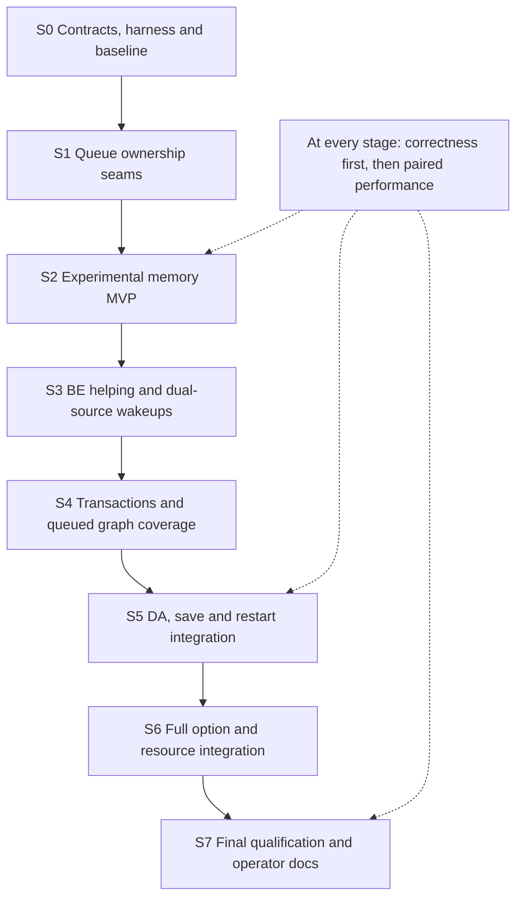

<!--
.. meta::
   :description: Staged implementation and validation plan for local SPSC queue fronts with shared MPMC and disk backing.
   :keywords: rsyslog, upcoming work, implementation plan, SPSC, threading, performance, MVP
-->

# Upcoming work: local queue implementation plan

| Metadata | Value |
|---|---|
| Status | **S0 accepted; S1/S2 implemented with recorded validation limits; performance qualification deferred** |
| Created / reviewed | 2026-09-14 |
| Design authority | [Local queue front ends with shared overflow](local-queue-frontends.md) |
| Source baseline | `b0d9f971f007f06db3f734543cef5dfb312c5090`; immutable implementation baseline recorded in the execution ledger |
| Reviewer | Existing Astra / medium architecture reviewer; findings and revision status in Section 16 |
| Completion target | Full initial design, reached through gated stages beginning with an experimental MVP |

<!-- .. summary-start -->
Implement private SPSC fronts inside one logical queue, retaining shared MPMC
and disk assistance. Establish ownership and admission contracts first, deliver a
restricted memory-only MVP, then add BE helping, broader execution coverage, disk
and recovery integration, and operator-ready configuration. Every stage receives
correctness checks and performance measurements. No optimization is accepted on
speed alone, and no intermediate MVP is presented as the completed feature.
<!-- .. summary-end -->

## 1. Authority, scope, and completion meaning

The linked design supplies behavioral invariants I1–I15, open decisions O1–O12,
and Astra findings AR1–AR5. This plan describes implementation order and evidence
requirements; it does not override the architecture or claim that proposed APIs
already exist. The maintainer subsequently authorized autonomous S0–S2
implementation. The [execution ledger](local-queue-execution-ledger.md) records
actual progress and the later decision to continue correctness work while
deferring representative performance data. Original performance classifications
remain unchanged; later stages below remain upcoming.

The full initial target includes:

- opt-in local scope on supported existing memory queue types;
- one FE per actual producer registration, 10K usable entries in the reference
  scenario, and whole-batch fit routing to the shared BE;
- dedicated FE consumers, bounded BE helping, and dedicated BE scheduling capacity;
- unchanged external submission/callback signatures where practicable;
- supported imtcp-rooted acyclic graphs, including downstream queued actions and
  rulesets, with current-worker registration at local boundaries;
- accurate logical admission, accounting, retry/completion and bounded resources;
- existing DA spill, graceful save, restart with changed workers/scope, and
  repeated shutdown during recovery;
- documented option compatibility, diagnostics, and performance evidence.

Other input plugins, arbitrary cycles, live configuration reload, worker
autoscaling, pure-disk local-scope configurations, and stronger crash guarantees
are extensions beyond this initial target. Inspect existing behavior before
claiming such combinations work. The supported subset must be enforced, not just
mentioned in release notes. Unmodified imtcp calls do not excuse unexamined
internal, diagnostic, recovery, or module-originated producer contexts.

## 2. Stage dependency graph



Stages may contain several small commits or PRs. Keep each patch independently
buildable, global mode correct, and unfinished local behavior behind an explicit
experimental opt-in. Do not expose an unsafe half-path just to make a stage runnable.
Follow the dependency order for design decisions even when mechanical work can be
prepared independently.

## 3. Gate applied after every stage

Each stage uses the same sequence:

1. Inspect the delta and restate changed invariants and supported combinations.
2. Run focused deterministic functional and failure tests.
3. Run the relevant memory and concurrency tooling; settle findings before timing.
4. Measure release-style builds against both the prior accepted stage and the
   frozen original MPMC baseline where a meaningful comparison exists.
5. Review results and decide retain, revise, reject, or inconclusive.
6. For a PR-ready stage, run the repository's full applicable local validation
   gate and record review receipts and hosted checks separately.

Do not run sanitizers, broad tests, builds, or competing benchmark agents alongside
performance measurement. Sanitizer timings are not performance results. S0 has no
candidate optimization: its performance deliverable is a validated baseline and
noise assessment. S1 must measure global-mode equivalence even if local mode is not
yet executable. S2 onward must include a stage-specific runtime performance result;
correctness-only success is insufficient to call the stage accepted.

A required correctness failure stops acceptance regardless of speed. A missed
performance target stops claims of improvement; do not silently change workload,
threshold, safety semantics, or supported features to obtain a pass.

## 4. S0: resolve contracts and establish measurements

### Deliverables

- A decision ledger answering O1–O12 to the degree needed by the next stage, with
  owner, chosen behavior, alternative rejected, and test ID. Correctness choices
  needed by S2 cannot remain merely marked open.
- A complete submission and completion inventory: single/multi-submit, thread
  registration, action/queued-ruleset fan-out, internal messages, retry/requeue,
  DA transfer, producer exit, cancellation and recovery.
- An option matrix classifying each existing queue parameter as logical,
  BE-specific, FE-specific, adapted, or rejected under local scope.
- A lock/atomic ownership table and queue dependency/activation/shutdown inventory,
  including declaration order different from dependency order.
- A benchmark extension under `benchmarks/queue-contention/` and deterministic
  helpers registered from `tests/Makefile.am`.

### Batching inventory required in S0

Apply [design Section 8.1](local-queue-frontends.md#81-existing-batching-contracts-actual-counts-not-fixed-blocks).
Also apply design Section 8.2: per-message submission occurs at mutation-sensitive
execution boundaries and is not an unimplemented batch optimization. Consumer-side
accumulation may deliberately serve target-preferred request sizes. Queue batches
are not SIMD work units. Do not delay upstream submissions to manufacture a larger
batch without separate semantic proof.

Record producer actual counts, dequeue ceilings, minimum-batch waiting, per-action
transaction accumulation and module wire-request boundaries separately. The
ordinary action enqueue path currently submits one message at a time. FE admission
must not assume that input batching survives that boundary.

From S2 onward, test varying actual counts under one configured maximum; singleton,
short/residual and oversized submissions; producer groups split/coalesced during
consumption; and ordinary FE/BE dequeues smaller than their ceiling. S3 adds
borrowed-helper partial-dequeue tests when helping is introduced. Verify no default wait
for a full batch. Include discard-driven `nElem`/`nElemDeq` differences and one-vs-
many action execution paths. Explicit minimum-batch options must be implemented
with a reviewed FE/helper interpretation or rejected at activation. S4 adds
module-internal partial bulk flush/commit tests.

The minimum/preferred-batch and helper-ceiling decision must cover a local worker
waiting to accumulate while BE is nonempty, timeout-driven partial batches, and
module byte-limit flushes. Accumulation never relaxes helper eligibility: FE must
be empty, with no retained batch or execution state preventing reuse. A short batch
waiting in FE, or already held by the consumer, does not authorize BE borrowing or
mixing leases. Serving BE while a nonempty FE accumulates requires a separately
reviewed scheduling-policy revision and ownership/priority tests. Reject unsupported
combinations explicitly in MVP;
resolve supported target-aware batching before S4 output qualification. Compare
request rates and messages/bytes per request: many small FE batches can offset
all queue-lock savings.

Performance reports record actual batch-size distributions separately for producer
submissions, FE dequeues, BE leases and output requests. Configured equal maxima
are not evidence of equal effective batching. Add a finite skewed burst entirely
within one FE (BE empty, other workers idle), comparing completion time and tail
latency with equal-resource MPMC at several callback costs. Helping cannot balance
work that never enters BE; this is a known private-queue tradeoff, not a reason to
invent a full-batch wait.

### Decisions required before S2

Specify FE registration bounds; message-reference consumption on every enqueue
outcome; usable ring capacity; aggregate memory policy; producer credit/wakeup
behavior; callback eligibility; shutdown routing quiescence; unresolved-batch
ownership; and the MVP's exact supported option combinations.

Proposed resource direction is bounded per-tier allocations with an explicit
logical aggregate budget or bounded credit scheme. Do not pick one from this plan
without checking historical watermark, discard, timeout and sampling semantics.
A rejected option must generate a clear configuration error. A fallback for an
unknown producer is allowed only if documented and tested as part of the logical
queue; it must not create another writer to an existing FE.

### Correctness and performance gate

Verify the baseline harness detects deliberately missing and duplicated IDs,
reports receiver completion separately from sender completion, and identifies
incomplete trials as failures. Measure current MPMC under the workload matrix in
Section 12, including the 10K/1M reference and skew. Establish noise before fixing
the final numeric acceptance contract. S0 is not a performance win.

## 5. S1: introduce ownership seams without changing routing

### Implementation work

Primary areas: `runtime/queue.[ch]`, `runtime/wti.[ch]`, `runtime/wtp.[ch]`, and
existing cleanup paths. Introduce the minimum internal distinction between
logical queue ownership, worker identity, and batch source. Global mode must still
use the same queues and execution semantics.

A conceptual batch lease identifies logical queue, source store, completion
context and ownership state. Acquisition, successful completion, retry and
cancellation must all dispatch to that source. Avoid an unnecessary indirect call
on every message: store decisions and completion can be batch-scoped.

Do not rewrite disk formats or consumer callback signatures. Define how shutdown
flags and queue mutex access remain associated with the right owner when a worker
will later borrow a batch. Separate type-specific storage from logical admission
only as far as later stages need.

### Correctness gate

Run existing memory queue, out-of-order retirement, transaction, shutdown and DA
retry/restart tests affected by the refactor. Add a lease ownership test covering
normal completion, retry, partial outcomes, and cancellation; it must catch
completion against the wrong source. Run TSan and ASan/UBSan on affected paths.

### Performance gate

Compare global mode against S0 with identical configuration, compiler and resources.
No intended behavior or material performance change. A regression beyond the
predeclared guardrail requires simplifying the abstraction before FE work proceeds.

## 6. S2: experimental memory-only MVP

### Minimum useful behavior

Implement per-producer FE registration, bounded SPSC batch publication, a dedicated
consumer per FE, and direct whole-batch overflow to the existing memory BE.
Consumers execute the logical callback using their own worker state. No helping
yet; retain dedicated BE workers. Do not implement sticky fullness or stall checks.

The first real pipeline is imtcp into a local main/ruleset queue, executing a
controlled nonblocking consumer path with Direct actions. Restrict asynchronous
fan-out and unsupported transaction configurations until S4. A deterministic test
consumer may inject controlled blocking/errors even before a production module is
qualified. Exact production support is an S0 result, not an assumed module list.

Allocation/registration failure has a specified BE fallback or error outcome. The
runtime bounds the number of FEs and retains producerless fronts until drained.
Single-message submission is a batch of one. The wrapper preserves existing BE
partial-admission/ownership behavior; whole-tier selection is not a new atomic BE
transaction guarantee.

### Pre-activation support gate

Before S2 can enable local scope, implement an explicit reachability whitelist
whose exact entries are decided in S0. imtcp ingress alone does not constrain
statements reached by the main/ruleset consumer. The MVP may reject all ruleset
calls, indirect calls and asynchronous boundaries instead of implementing S4's
broader validator. Reject unsupported reachable paths, cycles, producer contexts,
module configurations and queue options before activating the affected graph.
Apply the gate through the shared configuration backend and test both RainerScript
and YAML frontends from S2 onward, not only at final integration.

Internal or diagnostic submissions that cannot be excluded statically require a
specified runtime registration/admission policy. If they deliberately use BE,
document and test that fallback; never attach them as a second FE producer or
silently claim imtcp-only coverage. S4 expands this existing gate as graph support
is implemented. Later stages do not retroactively make an unsafe MVP acceptable.

### MVP instrumentation

Implement design Section 13.3's core impstats coverage with the MVP: logical
attempt/admission/routes and outstanding counts, per-FE identity/generation,
capacity/queued/active/retry inventory, local batch counts, overflow reasons,
registration lifecycle and shutdown transfers. S3 adds borrowing/source and
wake/accumulation details. S4 supplies actual target request-size evidence; S5
links disk/recovery outcomes. S6 completes compatibility and detailed diagnostics,
not the first chance to observe whether FE routing worked.

At every stage, reconcile outcomes at quiescence, test record retirement/reset
safety, and benchmark instrumentation disabled versus normal summary mode. From
S3 onward add enabled per-FE detail at a fixed reporting interval. Do not put shared
stats locks or clocks on every FE message by default. A detailed metric unavailable
at that stage is recorded as pending, not reported as zero.

### MVP safety floor

MVP does not mean postponing lifecycle correctness. It must include REDIRECT,
producer quiescence, FE-to-BE drain, source-correct active-batch cleanup, and tested
producer exit. Memory-only shutdown explicitly follows the configured drain/loss
policy; no restart guarantee is claimed. Reject DA/local until S5 rather than
accepting a combination whose pending FE work cannot be saved.

Minimum admission policies supported or explicitly rejected must be enforced from
this stage. Do not silently bypass global discard or flow-control checks just to
make the SPSC fast path benchmark well.

### Correctness gate

Exact-fit, no-fit, oversized batch, empty batch, many wraps, registration failure,
thread replacement, blocked callback, late publication during REDIRECT, producer
exit with backlog, and memory-only shutdown. Use an instrumented reference model
of obligations to verify each accepted ID reaches the appropriate terminal outcome
once in deterministic no-ambiguity tests. Exercise producer wakeup from FE-only
capacity release for the selected admission model (AR1). Test pre-activation
rejection of unsupported reachable calls/boundaries, cycles/indirect calls,
non-imtcp contexts and options through both configuration frontends. Test every
deliberate internal-message BE fallback. Preserve a producer cached-full
observation, let the consumer release space, and verify the next fitting batch
refreshes the index and enters FE without unrelated activity (IP3).

### Performance gate

Compare healthy balanced traffic and one hot producer with S0 and S1. Include
sustained FE overflow: freeze a consumer to fill 10K, route the next 1K to BE, then
resume and prove later fitting batches return to FE while BE is nonempty. Time
steady execution separately from barriers used to establish the scenario.
Report FE fraction, BE traffic and total consumer count. An MVP speedup is evidence
for routing/locality only, not full transaction/disk readiness.

## 7. S3: bounded BE helping and wake protocols

### Implementation work

At a reusable batch boundary, an FE consumer checks FE first, otherwise borrows
one bounded memory-BE batch. It processes with its private state and completes
against BE. Recheck FE before another borrowed batch. Do not push borrowed work
into FE or steal another FE's ring entries.

Eligibility includes no retained unresolved state preventing reuse (AR3). Keep a
small dedicated BE pool as scheduling capacity, not a promise that blocked targets
will progress (AR5). Preserve BE/DA arbitration seams even though DA/local remains
disabled until S5.

Implement dual-source notification and helper registration using a documented
happens-before argument. Implement producer admission wakeups separately. Avoid
unconditional shared scheduler locks or broadcasts on every FE enqueue.

### Correctness gate

Deterministic tests cover BE arrival around idle registration, FE arrival during
BE execution, all FEs busy with BE pending, dedicated BE workers blocked with a
healthy helper, shutdown during borrowing, and empty FE with unresolved FE batch.
Complete the forced-interleaving matrix in Section 11. TSan is required but does
not substitute for liveness tests or atomic publication reasoning.

### Performance gate

Compare against S2 under balanced and skewed traffic at the same worker budget.
Measure idle-to-help latency, BE oldest age, local latency after BE borrowing,
shared wake/registry cost, and CPU use while idle. Sweep a small declared set of
helper batch limits; retain batching benefits without hiding local latency growth.
Record all tested choices, not only the winning point.

## 8. S4: transactions and downstream queue graph

### Implementation work

Qualify the intended action and ruleset consumer paths, including real transaction
and retry behaviors. Cover omfwd, its multi-target behavior, and omelasticsearch
with both deterministic failure helpers and relevant actual module integration
lanes. Do not assume successful transport enqueue means remote delivery.

Extend local registration to downstream queued actions/rulesets. Any FE, BE or
recovery execution worker can be an upstream producer there. Synchronous calls
retain their worker; global boundaries intentionally merge. Enforce acyclic and
supported indirect-call rules. Enumerate internal/re-injection paths explicitly.

Before enabling any queued graph, implement dependency-order memory-queue shutdown
and coordinated logical deadlines. Keep downstream admission/drain available while
upstream consumers can still submit. Declaration order is not dependency order.
Use the S0 graph inventory and include helper-originated producers. This is an S4
activation prerequisite, not deferred disk work; S5 extends it to DA and recovery.

Specify ownership of unresolved FE messages without making the consumer a second
SPSC producer. Preserve worker-local connection buffers and transaction parameters.
Handle retry exhaustion, permanent errors, partial commits, fallback-dependent
script semantics, message duplication/copy settings and active callback shutdown.
If an output contract is incompatible, reject it pending an explicit extension.

### Correctness gate

Run per-message and multi-message transaction failure tests, partial success,
retry-exhaustion, concurrent FE/BE consumers, message mutation after enqueue,
queued ruleset fan-out, reverse declaration order, and producer count expansion.
Test stopped producer and child queues with backpressure. Explicitly start
shutdown in a reverse-declaration-order queued graph while an upstream callback
still owns work and downstream BE is full; verify progress and complete terminal
outcome accounting within the logical deadline. Audit `wti_t` action
state and cancellation paths with source-tagged leases. Run relevant service
integration plus TSan and memory sanitizers; mocks alone do not qualify outputs.

### Performance gate

Use healthy and throttled omfwd endpoints and a reproducible Elasticsearch test
service. Compare actual delivered throughput, CPU, batch sizes and connections;
fix service topology and receiver resources between trials. Include single-target
slowdown and multi-target uneven response. Separate endpoint-limited results from
queue-limited results. This stage can be correct with neutral throughput on an
endpoint-bound workload; it may not claim a queue speedup from that result.

## 9. S5: runtime DA, graceful persistence and restart

### Implementation work

Attach the shared BE to its existing disk assistance, coordinated by the logical
owner. Disk consumers execute the logical callback. FE helpers initially borrow
memory work only and respect DA transfer arbitration. Do not change persistence
formats merely to attach FE.

Extend S4's implemented graph-wide shutdown order and logical deadlines to DA
transfer, persistence and recovery-created producers. REDIRECT prevents new
FE admission only after pre-transition publishers are accounted for. Stop new
helping, settle existing BE leases, drain FE using a transfer API with explicit
ownership on failure/partial acceptance, and keep BE/DA useful until transfers
finish. Join a consumer before replacing it with a drainer.

Recovery uses the stable logical spool namespace with fresh FEs. Support changed
producer count and global/local transitions with compatible destinations. Recovery
workers creating downstream local fronts participate in subsequent shutdown.
Distinguish executed, persisted and configured-discard outcomes (AR2).

### Correctness gate

Test classic and supported segmented DA behavior separately. Include runtime spill,
FE+BE backlog save, BE already full, disk full/unavailable, transfer interruption,
reverse-declaration-order graph with active DA, different worker count restart,
global/local switch, and second shutdown before recovery finishes. Test memory-only
and save-disabled policies too. Assert outcomes per logical destination rather than
replaying roots and accidentally duplicating already completed actions.

### Performance gate

Measure runtime spill/drain and local fast-path overhead with DA configured but
inactive. Compare against S4 without DA and S0's corresponding DA configuration.
Measure shutdown consolidation with exact ownership/delivery oracles. Restart timing
is reported only if the harness isolates it without adding a second persistent
queue or moving unaccounted action-owned data outside the measured boundary; see
[rejected restart benchmarks](../rejected_engineering_paths.md). Functional restart
evidence is mandatory even when a clean timing experiment is unavailable.

## 10. S6 and S7: full initial feature and qualification

### S6: option, resource and operational integration

Complete the S0 option matrix for the full initial supported subset. Implement
remaining logical flow-control/watermark/discard/sampling semantics, FE registration
caps, aggregate budgets, impstats compatibility and diagnostics. Any narrowing
relative to the initial target must be recorded as deferred work, not hidden by
calling the MVP complete. Both FixedArray and LinkedList BE are qualified; any
other combination is explicitly rejected or separately validated.

Correctness covers budget exhaustion and reclamation, FE-only producer wakes,
registration churn, misleading queue-empty states, tier transfer counters, and
configuration errors across RainerScript/YAML frontends. Performance repeats all
fast-path workloads with final accounting/stats enabled and disabled. Sweep FE
capacity around the 10K reference without changing the equal-memory contract.
This is where apparently cheap global counters often erase an earlier gain.

### S7: release candidate for the full initial design

Complete operator docs, parameter distribution registration, current architecture
metadata, configuration validation, and troubleshooting guidance. Global remains
default. State ordering changes, consumer multiplication, supported inputs/options,
memory bounds, fallback behavior and persistence prerequisites explicitly.

Run the complete acceptance matrix and independent performance sessions using final
code. No speedup claim inherits from an earlier stage missing final accounting,
retries or shutdown support. Check global-mode regression on final code too.
Complete repository security review and local validation gates. Record hosted review
status separately; another document review does not replace code review.

Completion means all S0–S7 deliverables and gates pass for the full declared initial
scope. Remaining extensions have explicit restrictions and follow-up entries. An
MVP or targeted-only test run does not satisfy this completion definition.

## 11. Synchronization strategy and threading proof obligations

### 11.1 Fast synchronization where it helps

Use bounded SPSC rings with separate producer/consumer cache lines and batch-level
acquire/release publication. Avoid per-element CAS when ownership already provides
exclusivity. Cache opposite indices conservatively where proven safe. Cached consumer positions
may prove that a batch fits, but a cached no-fit result must trigger a fresh
acquire observation before returning no-fit and routing to BE. This does not
promise an instantaneous synchronized capacity snapshot; it prevents a producer
cache from indefinitely hiding released slots and defeating FE reuse. Cached
observations must never permit overwriting unread entries. Document sequence
wrap arithmetic and usable capacity, including near-limit tests.

Use relaxed atomics only for observations that require atomicity without ordering
other data, such as suitable diagnostic counters. Document each nontrivial memory
order and its corresponding publication/observation. Do not replace acquire/release
with `volatile`, infer ordering from wake syscalls, or assume x86 makes a C data
race safe. Verify lock-free properties on supported targets or choose a documented
fallback; “atomic” does not inherently mean lock-free on every architecture.

Registration, teardown and rare control-plane updates can use short mutex sections.
BE keeps its established synchronization. Consider a portable condition-variable
parking protocol first; use futex/eventfd or another platform primitive only with
an equivalent tested fallback and evidence of benefit. Do not busy-spin indefinitely
when output callbacks may block. Any bounded spin experiment records CPU and idle
power/cost proxies as well as throughput.

The exact quiescence, helper-notification and logical-credit mechanisms are S0/S3
review decisions. “Use fast sync” is not permission to remove the synchronization
that proves lifetime or shutdown safety. Compare optimized variants one at a time.

### 11.2 Required ownership table

Before code review, fill a table for ring slots/indices, producer cache entries,
registration generations, routing state, active leases, action worker data, helper
wait registrations, credits, logical counters and shutdown completion counts.
For each: unique writer or protecting lock; readers; publication relation; destructor;
who wakes waiters; and behavior during cancellation. Specify a lock order for the
owner registry, FE lifecycle, BE, DA, and worker-pool locks, avoiding nested waits
that need another holder to make progress.

### 11.3 Forced interleavings

Use test-only hooks/barriers around:

- route read versus REDIRECT and FE publication;
- ring data initialization versus write-index publication;
- batch acquisition versus slot reuse;
- empty observation versus waiter registration/recheck/park;
- BE notification versus helper departure;
- logical credit release versus producer park;
- producer cache lookup versus registration retirement/reuse;
- callback return versus cancellation and lease completion;
- FE drain transfer versus BE admission failure;
- final upstream producer departure versus BE/DA shutdown.

Assertions verify ownership/progress, not a particular scheduler order. Add bounded
randomized stress with recorded seeds and varied capacities/batches, but deterministic
counterexample tests remain primary. Also run an uninstrumented stress lane with
test barriers/hooks disabled: hooks can introduce ordering that masks publication
mistakes. Record architecture, compiler, atomic implementation and CPU affinity;
cover a weakly ordered supported architecture when available, reporting any gap.
Such stress complements rather than proves the memory-order argument. TSan detects some data races, not lost wakeups,
ABA-like lifetime mistakes or all incorrect atomic memory orders. Use manual
happens-before review and, for the small ring/wakeup primitives, an available C/C++
memory-model checker where practical. Tool absence must be reported; it cannot be
replaced with “TSan passed, therefore proven.”

## 12. Performance contract for every stage

### 12.1 Baselines and budgets

Freeze S0 and retain an accepted revision after each stage. Compare candidate to
both prior stage (incremental cost) and S0 (whole-feature effect). Refreshing upstream
requires a new paired baseline; do not compare timings across compiler or upstream
changes without controlling them.

Primary comparisons hold total memory budget, total processing worker budget,
input worker count, output connections where controllable, payloads, batching,
receiver resources and compiler settings constant. The 10K/1M scenario is also
reported as an explicit configuration comparison: `P*10K + 1M` queue slots plus
active holdings. Give pure MPMC the corresponding total capacity for the
resource-matched comparison. If per-worker connections cannot be matched, identify
the confound and use a controlled output for causal queue comparisons.

Separate an additive-worker experiment using the unchanged 1M BE from equal-budget
results. Account for FE/BE/disk consumers, input threads, stacks, metadata, active
batches and property payloads. Never label more threads as a synchronization win.

### 12.2 Workloads and stage selection

| ID | Workload | Required from |
|---|---|---|
| P0 | Existing global queue, low and high contention | S0 onward |
| P1 | Balanced producers, cheap controlled healthy output | S2 onward |
| P2 | One hot producer / other FEs idle | S2 onward; helping attribution from S3 |
| P3 | 10K full, next 1K overflow, continued FE reuse | S2 onward |
| P4 | Burst then idle; wake latency and idle CPU | S2 onward |
| P5 | Helper batch-size sweep; FE arrival during BE work | S3 onward |
| P6 | Real omfwd and omelasticsearch, healthy/throttled | S4 onward |
| P7 | DA inactive overhead and active spill/drain | S5 onward |
| P8 | Shutdown/save and functional topology-changing restart | S5 onward |
| P9 | Final stats, credits, caps and both memory BE types | S6 onward |

Record throughput, CPU time per delivered message, latency p50/p95/p99, BE oldest
age, occupancy, FE fraction, helper fraction, shared waiting, RSS and observed
worker/connection counts. Use monotonic clocks or an explicitly synchronized
latency method; do not subtract unsynchronized sender/receiver wall clocks.

### 12.3 Thresholds and repeatability

Proposed starting contract, to finalize in S0 before candidate measurement:

- H1 success: at least 10% improvement in primary contention-screen throughput
  or at least 10% reduction in CPU per delivered message while throughput stays
  within its guardrail; select the primary metric in advance, not after seeing data.
- Throughput / CPU regression guardrails: no more than 5% degradation on declared
  low-contention and global-mode controls.
- Tail latency: no more than 10% regression on the controlled healthy-output
  workload at a fixed offered load; set an absolute allowance in S0 for latency
  near timer resolution. Do not apply that bound to deliberately blocked callbacks.
- No unexpected loss, duplicate, deadlock, unbounded growth or policy bypass in
  deterministic correctness cases. Remote ambiguity has a separately specified
  allowed outcome, never an undocumented exception.

Not every foundational or correctness stage must improve performance by 10%.
S1 is neutral; later stages must satisfy incremental guardrails and explain their
cost. S3 needs evidence of useful skew/backlog improvement, and S7 must satisfy the
chosen whole-feature success target. A stage that fails is revised, rejected, or
explicitly parked; do not silently proceed as though accepted.

Use one unrecorded calibration pair, at least eleven alternating measured pairs,
and two independent sessions under the repository performance procedure. Report
paired medians, median absolute deviation, outliers, full commands, image IDs,
compiler flags, host sharing and timestamps. Short screens can reject a poor
candidate early but cannot replace stage acceptance sessions. Assign each stage's primary comparison and incremental guardrails in S0, including
S3's required skew/backlog benefit, before running that candidate. Fix the statistical
rule for declaring noise/inconclusive in S0; rerun once under steadier conditions
before classifying an effect that cannot be separated from noise.

## 13. Build, correctness and review execution

Use dedicated worktrees for code, baseline and candidate; never build in the base
coordination checkout. Test registration belongs in `tests/Makefile.am`, including
unconditional distribution and inline intent/oracle comments. Test helpers use
per-test paths, dynamically allocated ports and handshake readiness. Check shell
and Python changes with available repository linters.

For runtime stages, follow the current
[build](../../../.agent/skills/rsyslog_build/SKILL.md),
[test](../../../.agent/skills/rsyslog_test/SKILL.md),
[local security review](../../../.agent/skills/rsyslog-security-pr-review/SKILL.md),
and [container validation](../../../.agent/skills/rsyslog_local_container_testing/SKILL.md)
skills. The repository helper classifies the actual diff:

```sh
devtools/local-validation-plan.sh
devtools/format-code.sh --git-changed --check --check-if-available
# Run the selected checks only in a capable validation worktree:
devtools/local-validation-plan.sh --run
```

Core queue/thread changes require relevant TSan, ASan/UBSan and compiler portability
coverage in addition to the change-gated Ubuntu 26.04 check, analyzer and late
ownership/concurrency audits. Test/build-manifest changes need mock distribution
checks. Do not disable service families affected by shared queue changes merely
to shorten validation. imtcp mode-sensitive changes need poll/select coverage.
Honor current local capacity overrides for builds/tests, but record benchmark CPU
and worker allocation separately and avoid competing work during timing.

Missing tooling or unusable containers is reported with exact remaining coverage;
focused tests are not called full validation. No stage is PR-ready without the
required current review receipt and validation, or an explicit accepted reduction
in scope under repository rules. Record hosted review status separately. This
planning document itself is internal-doc-only and needs no runtime tests.

## 14. Stage evidence record and review checkpoints

Each stage must produce a durable, machine-neutral summary linked to ignored raw
artifacts, with this minimum schema:

```text
stage / status / baseline / candidate / source dirty state
supported and rejected configuration combinations
resolved O-decisions and I-invariants changed
correctness tests + deterministic oracles + outcome counts
sanitizers / compiler lanes / container tag and ID / commands / skips
security and concurrency review findings + dispositions
performance workload + resource budgets + offered load + receiver setup
paired results + dispersion + thresholds + regressions + inconclusive cases
retained/rejected variants + next-stage prerequisites
```

Review at S0 contract closure, S2 MVP, S3 helping, S5 lifecycle integration, and S7
final qualification. Reuse an informed reviewer where possible but provide the
exact patch/document baseline and fresh test evidence. Request targeted review of
AR1–AR5 at S2/S3/S5. An AI reviewer evaluates evidence; it does not substitute for
interleaving tests or sanitizer execution.

## 15. Subagent execution and handoff protocol

This session remains the coordinator and the user's discussion partner. The user
may interleave other tasks; preserve the implementation ledger and baseline rather
than treating each new discussion as cancellation. Before resuming runtime work,
check worktree/agent state, pending findings and evidence freshness. Do not run
unrelated resource-heavy tasks concurrently with accepted benchmark sessions.

The user permits subagents for implementation stages. Delegation is optional, not
an instruction to launch all stages concurrently. A coordinating agent owns the
stage ledger, final integration, conflict resolution and acceptance decision.

### 15.1 Model and reasoning allocation

Functionality and correctness take priority over cost. Use the following starting
allocation, adjusted to demonstrated task difficulty and current availability:

| Task | Starting model / reasoning | Escalation or limit |
|---|---|---|
| Coordinator/integration | Current session/model | Own decisions, integrated evidence and user communication |
| Informed architecture/stage reviewer | Existing Astra agent, medium | Reuse context; fresh diff and evidence required every time |
| Bounded runtime implementation or test harness | `gpt-5.6-terra`, high | Escalate to Astra/high for ambiguous ownership or coupled lifecycle changes |
| Fresh concurrency/lifecycle review at S3 and S5 | `gpt-6-astra`, high | Independent review of exact candidate, not just the informed reviewer's conclusions |
| Final independent review at S7 | `gpt-6-astra`, high | Full supported contract and final evidence |
| Mechanical documentation/link/inventory work | `gpt-5.6-luna`, medium, or coordinator | Do not delegate semantic concurrency decisions to a cheaper model merely to save cost |

Avoid redundant full-context agents for simple work. Give bounded task packets,
reuse informed reviewers, and escalate promptly when evidence exposes uncertainty.
Do not run a cheaper first pass on a critical lock/lifetime design merely to add
another review layer. Model labels are allocation guidance, not evidence that code
is correct. If a selected model is unavailable, record the replacement and preserve
the task's reasoning requirements.

### 15.2 Useful bounded assignments

| Assignment | Independent deliverable | Constraint |
|---|---|---|
| Contract/code inventory | Source-backed ownership, option or submission map | Read-only until coordinator accepts contracts |
| Ring primitive | Bounded implementation plus reference/interleaving tests | Interface and memory model agreed first |
| Test oracle/harness | Deterministic helper and tests for a fixed contract | Do not encode an unreviewed implementation as the oracle |
| Independent concurrency review | Counterexamples and path-sensitive findings | Read-only review of exact candidate revision |
| Benchmark execution | Reproducible stage report and raw artifacts | One measurement owner; no overlapping load from other agents |
| Documentation/option matrix | Operator and compatibility updates | Describe only supported validated behavior |

Separate mutable work into dedicated worktrees/branches and assign file ownership.
Do not have multiple agents edit `queue.c`, `wti.*` or the same test manifest
concurrently without explicit integration sequencing. All agents follow repository
and local worktree instructions. Shared machine CPU, Docker and memory capacity
remain shared even when worktrees are separate.

### 15.3 Required task packet

Each delegated task receives the design and this plan, exact baseline and stage,
accepted O-decisions, relevant invariants/AR findings, supported combinations,
allowed file scope, API contracts, resource budget and required test oracles.
State what the agent must not change and which downstream stages depend on it.
The agent returns commit/diff identity, changed files, commands and outcomes,
remaining gaps, and any proposed contract deviation. No agent may silently weaken
an invariant to pass tests or revise performance thresholds after seeing results.

### 15.4 Integration and acceptance

Integrate dependencies sequentially into the stage candidate. Re-run affected
functional/concurrency checks on the integrated revision; results on disjoint
branches do not prove their combination. Freeze the final candidate before paired
performance sessions and stop all competing agent workloads while measuring.
If a reviewer triggers a code change, invalidate affected evidence and repeat the
appropriate checks before acceptance.

The coordinator records each stage as not started, active, blocked, rejected,
inconclusive, or accepted. Accepted means the documented gates passed, not merely
that a subagent returned success. Handoffs must include unresolved findings and
exact baseline identities so work can safely continue in another session.

### 15.5 Stage review cadence

The coordinator integrates implementation; the informed Astra reviewer challenges
the stabilized exact stage diff after deterministic checks and before acceptance.
Use fresh independent concurrency reviews at S3 (helping/wakeups), S5
(shutdown/DA/recovery), and S7 final qualification. If either review changes code,
repeat affected validation before measuring or accepting the frozen candidate.
Review approval alone never satisfies a stage gate.

## 16. Review record

### 16.1 Initial review, 2026-09-14

The existing independent `gpt-6-astra` reviewer at medium reasoning effort reviewed
the initial plan and supporting source read-only. No code was edited and no runtime
tests were run. Its verdict was **sound staged plan, with three revisions needed**,
with no architectural feasibility blocker. Original line references in the table
refer to the pre-revision plan and are retained only as review provenance.

| Finding | Evidence / priority | Revision |
|---|---|---|
| IP1 | High; S4 lines 267–285 enables graphs before S5 lines 305–309 implements graph shutdown. Existing ruleset destruction is not topological. | S4 now implements dependency-order memory shutdown before graph activation; S5 extends it to DA/recovery. Added full-downstream reverse-declaration-order shutdown oracle. |
| IP2 | High; S2 lines 182–213 lacks an explicit activation validator while broader validation appears in S4/S6. imtcp-rooted execution can still reach unsupported statements. | Added S2 pre-activation reachability whitelist, both-frontend rejection tests, runtime treatment of unclassified producers and tested internal BE fallback. |
| IP3 | Medium; lines 374–378 allow cached-full routing to BE without refresh, potentially hiding newly available FE space indefinitely. | Require fresh acquire observation before declaring no-fit; added cached-full then consumer-release FE-reuse test. |

The reviewer also endorsed the ownership/lifecycle safety floor, per-stage
performance testing, equal-resource attribution, sanitizer limitations, and
subagent protocol. Its nonblocking suggestions were incorporated: S0 assigns
stage-specific primary comparisons/guardrails, and concurrency validation includes
stress with test synchronization disabled plus architecture/atomic details.

These are plan-readiness priorities, not security severities or proven runtime
defects. AR1–AR5 from the design remain applicable. The revisions above were verified by the same reviewer; the outcome follows.


### 16.2 Revision verification, 2026-09-14

The same Astra / medium reviewer verified IP1–IP3 and both nonblocking suggestions
as addressed. It found **no remaining blocking plan inconsistency** and concluded
that the revised plan is ready to guide S0 and subsequent gated implementation.

Verified requirements: S2 whitelist/frontend/runtime producer handling; S4 graph
shutdown before activation; S5 extension to DA/recovery; fresh capacity observation
before no-fit; deterministic FE-reuse test; uninstrumented stress; and predeclared
stage-specific performance comparisons. This is review of the planning requirements,
not verification of runtime correctness, performance, or implemented behavior.

### 16.3 Batching, prior art and observability revision

A further revision incorporates mutation-sensitive submission, target-preferred
batching, [prior-art synthesis](local-queue-related-work.md), per-FE impstats and
logical reconciliation requirements, and the agreed coordinator/model allocation.
The same Astra / medium reviewer reviewed the additions and relevant batching
source paths. It endorsed the statistics contract, batching distinctions,
calibrated prior-art claims, and delegation plan, subject to two revisions:

| Finding | Priority | Disposition |
|---|---|---|
| BR1 | Medium | Design Section 8.2 and this plan now state that accumulation does not relax empty-FE/reusable-state helper eligibility. Serving BE while a nonempty FE accumulates would require an explicit policy revision with ownership and priority tests. |
| BR2 | Minor sequencing correction | Ordinary partial FE/BE dequeue tests begin in S2; borrowed-helper partial-dequeue tests begin in S3 when helping is introduced. |

The reviewer verified both revisions on 2026-09-14 and found no remaining blocking
inconsistency in these additions. The positive planning verdict stands. This review
does not establish runtime correctness or measured performance; those remain
subject to implementation-stage validation.
