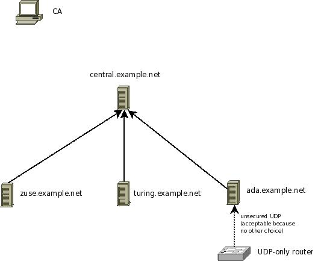

Setting up the UDP syslog relay
===============================

In this step, we configure the UDP relay ada.example.net. As a reminder,
that machine relays messages from a local router, which only supports
UDP syslog, to the central syslog server. The router does not talk
directly to it, because we would like to have TLS protection for its
sensitive logs. If the router and the syslog relay are on a sufficiently
secure private network, this setup can be considered reasonable secure.
In any case, it is the best alternative among the possible configuration
scenarios.

Steps to do:

-  make sure you have a functional CA (`Setting up the
   CA <tls_cert_ca.html>`_)
-  generate a machine certificate for ada.example.net (follow
   instructions in `Generating Machine
   Certificates <tls_cert_machine.html>`_)
-  make sure you copy over ca.pem, machine-key.pem ad machine-cert.pem
   to the client. Ensure that no user except root can access them
   (**even read permissions are really bad**).
-  configure the client so that it checks the server identity and sends
   messages only if the server identity is known.

These were essentially the same steps as for any `TLS syslog
client <tls_cert_client.html>`_. We now need to add the capability to
forward the router logs:

-  make sure that the firewall rules permit message reception on UDP
   port 514 (if you use a non-standard port for UDP syslog, make sure
   that port number is permitted).
-  you may want to limit who can send syslog messages via UDP. A great
   place to do this is inside the firewall, but you can also do it in
   rsyslog.conf via an $AllowedSender directive. We have used one in the
   sample config below. Please be aware that this is a kind of weak
   authentication, but definitely better than nothing...
-  add the UDP input plugin to rsyslog's config and start a UDP listener
-  make sure that your forwarding-filter permits to forward messages
   received from the remote router to the server. In our sample
   scenario, we do not need to add anything special, because all
   messages are forwarded. This includes messages received from remote
   hosts.

**At this point, please be reminded once again that your security needs
may be quite different from what we assume in this tutorial. Evaluate
your options based on your security needs.**

Sample syslog.conf
~~~~~~~~~~~~~~~~~~

Keep in mind that this rsyslog.conf sends messages via TCP, only. Also,
we do not show any rules to write local files. Feel free to add them.

::

    # start a UDP listener for the remote router
    module(load="imudp")   # load UDP server plugin
    $AllowedSender UDP, 192.0.2.1 # permit only the router
    input(type="imudp"
    port="514" # listen on default syslog UDP port 514
    )

    # make gtls driver the default and set certificate files
    global(
    DefaultNetstreamDriver="gtls"
    DefaultNetstreamDriverCAFile="/path/to/contrib/gnutls/ca.pem"
    DefaultNetstreamDriverCertFile="/path/to/contrib/gnutls/cert.pem"
    DefaultNetstreamDriverKeyFile="/path/to/contrib/gnutls/key.pem"
    )

    # set up the action for all messages
    action(
    type="omfwd"
    target="central.example.net"
    protocol="tcp"
    port="6514"
    StreamDriver="gtls"
    StreamDriverMode="1" # run driver in TLS-only mode
    StreamDriverAuthMode="x509/name"
    StreamDriverPermittedPeers="central.example.net"
    )

**Be sure to safeguard at least the private key (machine-key.pem)!** If
some third party obtains it, you security is broken!
