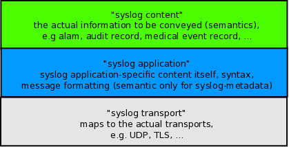

Message parsers in rsyslog
==========================

Written by `Rainer Gerhards <https://rainer.gerhards.net/>`_
(2009-11-06)

Intro
-----

Message parsers are a feature of rsyslog 5.3.4 and above. In this
article, I describe what message parsers are, what they can do and how
they relate to the relevant standards. I will also describe what you cannot 
do with them. Finally, I give some advice on implementing your own
custom parser.

What are message parsers?
-------------------------

Well, the quick answer is that message parsers are the component of
rsyslog that parses the syslog message after it is being received. Prior
to rsyslog 5.3.4, message parsers where built in into the rsyslog core
itself and could not be modified (other than by modifying the rsyslog
code).

In 5.3.4, we changed that: message parsers are now loadable modules
(just like input and output modules). That means that new message
parsers can be added without modifying the rsyslog core, even without
contributing something back to the project.

But that doesn't answer what a message parser really is. What does it
mean to "parse a message" and, maybe more importantly, what is a
message? To answer these questions correctly, we need to dig down into
the relevant standards. `RFC5424 <https://datatracker.ietf.org/doc/html/rfc5424>`_
specifies a layered architecture for the syslog protocol:

   RFC5424 syslog protocol layers

For us important is the distinction between the syslog transport and the
upper layers. The transport layer specifies how a stream of messages is
assembled at the sender side and how this stream of messages is
disassembled into the individual messages at the receiver side. In
networking terminology, this is called "framing". The core idea is that
each message is put into a so-called "frame", which then is transmitted
over the communications link.

The framing used is depending on the protocol. For example, in UDP the
"frame"-equivalent is a packet that is being sent (this also means that
no two messages can travel within a single UDP packet). In "plain tcp
syslog", the industry standard, LF is used as a frame delimiter (which
also means that no multi-line message can properly be transmitted, a
"design" flaw in plain tcp syslog). In
`RFC5425 <https://datatracker.ietf.org/doc/html/rfc5425>`_ there is a header in
front of each frame that contains the size of the message. With this
framing, any message content can properly be transferred.

And now comes the important part: **message parsers do NOT operate at
the transport layer**, they operate, as their name implies, on messages.
So we can not use message parsers to change the underlying framing. For
example, if a sender splits (for whatever reason) a single message into
two and encapsulates these into two frames, there is no way a message
parser could undo that.

A typical example may be a multi-line message: let's assume some
originator has generated a message for the format "A\\nB" (where \\n
means LF). If that message is being transmitted via plain tcp syslog,
the frame delimiter is LF. So the sender will delimit the frame with LF,
but otherwise send the message unmodified onto the wire (because that is
how things are -unfortunately- done in plain tcp syslog...). So wire
will see "A\\nB\\n". When this arrives at the receiver, the transport
layer will undo the framing. When it sees the LF after A, it thinks it
finds a valid frame delimiter (in fact, this is the correct view!). So
the receive will extract one complete message A and one complete message
B, not knowing that they once were both part of a large multi-line
message. These two messages are then passed to the upper layers, where
the message parsers receive them and extract information. However, the
message parsers never know (or even have a chance to see) that A and B
belonged together. Even further, in rsyslog there is no guarantee that A
will be parsed before B - concurrent operations may cause the reverse
order (and do so very validly).

The important lesson is: **message parsers can not be used to fix a
broken framing**. You need a full protocol implementation to do that,
what is the domain of input and output modules.

I have now told you what you can not do with message parsers. But what
they are good for? Thankfully, broken framing is not the primary problem
of the syslog world. A wealth of different formats is. Unfortunately,
many real-world implementations violate the relevant standards in one
way or another. That makes it often very hard to extract meaningful
information from a message or to process messages from different sources
by the same rules. In my article `syslog parsing in
rsyslog <syslog_parsing.html>`_ I have elaborated on all the real-world
evil that you can usually see. So I won't repeat that here. But in
short, the real problem is not the framing, but how to make malformed
messages well-looking.

**This is what message parsers permit you to do: take a (well-known)
malformed message, parse it according to its semantics and generate
perfectly valid internal message representations from it.** So as long
as messages are consistently in the same wrong format (and they usually
are!), a message parser can look at that format, parse it, and make the
message processable just like it were well formed in the first place.
Plus, one can abuse the interface to do some other "interesting" tricks,
but that would take us to far.

While this functionality may not sound exciting, it actually solves a
very big issue (that you only really understand if you have managed a
system with various different syslog sources). Note that we were often
able to process malformed messages in the past with the help of the
property replacer and regular expressions. While this is nice, it has a
performance hit. A message parser is a C code, compiled to native
language, and thus typically much faster than any regular expression
based method (depending, of course, on the quality of the
implementation...).

How are message parsers used?
-----------------------------

In a simplified view, rsyslog

#. first receives messages (via the input module),
#. *then parses them (at the message level!)* and
#. then processes them (operating on the internal message
   representation).

Message parsers are utilized in the second step (written in italics).
Thus, they take the raw message (NOT frame!) received from the remote
system and create the internal structure out of it that the other parts
of rsyslog need in order to perform their processing. Parsing is vital,
because an unparsed message can not be processed in the third stage, the
actual application-level processing (like forwarding or writing to
files).

Parser Chains and how they Operate
~~~~~~~~~~~~~~~~~~~~~~~~~~~~~~~~~~

Rsyslog chains parsers together to provide flexibility. A **parser
chain** contains all parsers that can potentially be used to parse a
message. It is assumed that there is some way a parser can detect if the
message it is being presented is supported by it. If so, the parser will
tell the rsyslog engine and parse the message. The rsyslog engine now
calls each parser inside the chain (in sequence!) until the first parser
is able to parse the message. After one parser has been found, the
message is considered parsed and no others parsers are called on that
message.

Side-note: this method implies there are some "not-so-dirty" tricks
available to modify the message by a parser module that declares itself
as "unable to parse" but still does some message modification. This was
not a primary design goal, but may be utilized, and the interface
probably extended, to support generic filter modules. These would need
to go to the root of the parser chain. As mentioned, the current system
already supports this.

The position inside the parser chain can be thought of as a priority:
parser sitting earlier in the chain take precedence over those sitting
later in it. So more specific parser should go earlier in the chain. A
good example of how this works is the default parser set provided by
rsyslog: rsyslog.rfc5424 and rsyslog.rfc3164, each one parses according
to the rfc that has named it. RFC5424 was designed to be distinguishable
from RFC3164 message by the sequence "1 " immediately after the
so-called PRI-part (don't worry about these words, it is sufficient if
you understand there is a well-defined sequence used to identify RFC5424
messages). In contrary, RFC3164 actually permits everything as a valid
message. Thus the RFC3164 parser will always parse a message, sometimes
with quite unexpected outcome (there is a lot of guesswork involved in
that parser, which unfortunately is unavoidable due to existing
technology limits). So the default parser chain is to try the RFC5424
parser first and after it the RFC3164 parser. If we have a
5424-formatted message, that parser will identify and parse it and the
rsyslog engine will stop processing. But if we receive a legacy syslog
message, the RFC5424 will detect that it can not parse it, return this
status to the engine which then calls the next parser inside the chain.
That usually happens to be the RFC3164 parser, which will always process
the message. But there could also be any other parser inside the chain,
and then each one would be called unless one that is able to parse can
be found.

If we reversed the parser order, RFC5424 messages would incorrectly
parsed. Why? Because the RFC3164 parser will always parse every message,
so if it were asked first, it would parse (and misinterpret) the
5424-formatted message, return it did so and the rsyslog engine would
never call the 5424 parser. So order of sequence is very important.

What happens if no parser in the chain could parse a message? Well, then
we could not obtain the in-memory representation that is needed to
further process the message. In that case, rsyslog has no other choice
than to discard the message. If it does so, it will emit a warning
message, but only in the first 1,000 incidents. This limit is a safety
measure against message-loops, which otherwise could quickly result from
a parser chain misconfiguration. **If you do not tolerate loss of
unparsable messages, you must ensure that each message can be parsed.**
You can easily achieve this by always using the "rsyslog-rfc3164" parser
as the *last* parser inside parser chains. That may result in invalid
parsing, but you will have a chance to see the invalid message (in debug
mode, a warning message will be written to the debug log each time a
message is dropped due to inability to parse it).

Where are parser chains used?
~~~~~~~~~~~~~~~~~~~~~~~~~~~~~

We now know what parser chains are and how they operate. The question is
now how many parser chains can be active and how it is decided which
parser chain is used on which message. This is controlled via
:doc:`rsyslog's rulesets <multi_ruleset>`. In short, multiple rulesets can be
defined and there always exist at least one ruleset.
A parser chain is bound to a
specific ruleset. This is done by virtue of defining parsers via the
:doc:`$RulesetParser <../configuration/ruleset/rsconf1_rulesetparser>`
configuration directive
(for specifics, see there). If no such directive is specified, the
default parser chain is used. As of this writing, the default parser
chain always consists of "rsyslog.rfc5424", "rsyslog.rfc3164", in that
order. As soon as a parser is configured, the default list is cleared
and the new parser is added to the end of the (initially empty)
ruleset's parser chain.

The important point to know is that parser chains are defined on a
per-ruleset basis.

Can I use different parser chains for different devices?
~~~~~~~~~~~~~~~~~~~~~~~~~~~~~~~~~~~~~~~~~~~~~~~~~~~~~~~~

The correct answer is: generally yes, but it depends. First of all,
remember that input modules (and specific listeners) may be bound to
specific rulesets. As parser chains "reside" in rulesets, binding to a
ruleset also binds to the parser chain that is bound to that ruleset. As
a number one prerequisite, the input module must support binding to
different rulesets. Not all do, but their number is growing. For
example, the important `imudp <imudp.html>`_ and `imtcp <imtcp.html>`_
input modules support that functionality. Those that do not (for example
`im3195 <im3195>`_) can only utilize the default ruleset and thus the
parser chain defined in that ruleset.

If you do not know if the input module in question supports ruleset
binding, check its documentation page. Those that support it have the
required directives.

Note that it is currently under evaluation if rsyslog will support
binding parser chains to specific inputs directly, without depending on
the ruleset. There are some concerns that this may not be necessary but
adds considerable complexity to the configuration. So this may or may
not be possible in the future. In any case, if we decide to add it,
input modules need to support it, so this functionality would require
some time to implement.

The cookbook recipe for using different parsers for different devices
is given as an actual in-depth example in the
`$RulesetParser` configuration directive
doc page. In short, it is accomplished by defining specific rulesets for
the required parser chains, defining different listener ports for each
of the devices with different format and binding these listeners to the
correct ruleset (and thus parser chains). Using that approach, a variety
of different message formats can be supported via a single rsyslog
instance.

Which message parsers are available
-----------------------------------

As of this writing, there exist only two message parsers, one for
RFC5424 format and one for legacy syslog (loosely described in
`RFC3164 <https://datatracker.ietf.org/doc/html/rfc3164>`_). These parsers are
built-in and must not be explicitly loaded. However, message parsers can
be added with relative ease by anyone knowing to code in C. Then, they
can be loaded via $ModLoad just like any other loadable module. It is
expected that the rsyslog project will be contributed additional message
parsers over time, so that at some point there hopefully is a rich
choice of them (I intend to add a browsable repository as soon as new
parsers pop up).

How to write a message parser?
~~~~~~~~~~~~~~~~~~~~~~~~~~~~~~

As a prerequisite, you need to know the exact format that the device is
sending. Then, you need moderate C coding skills, and a little bit of
rsyslog internals. I guess the rsyslog specific part should not be that
hard, as almost all information can be gained from the existing parsers.
They are rather simple in structure and can be found under the "./tools"
directory. They are named pmrfc3164.c and pmrfc5424.c. You need to
follow the usual loadable module guidelines. It is my expectation that
writing a parser should typically not take longer than a single day,
with maybe a day more to get acquainted with rsyslog. Of course, I am
not sure if the number is actually right.

If you can not program or have no time to do it, Adiscon can also write
a message parser for you as part of the `rsyslog professional services
offering <http://www.rsyslog.com/professional-services>`_.

Conclusion
----------

Malformed syslog messages are a pain and unfortunately often seen in
practice. Message parsers provide a fast and efficient solution for this
problem. Different parsers can be defined for different devices, and
they all convert message information into rsyslog's well-defined
internal format. Message parsers were first introduced in rsyslog 5.3.4
and also offer some interesting ideas that may be explored in the future
- up to full message normalization capabilities. It is strongly
recommended that anyone with a heterogeneous environment take a look at
message parser capabilities.
