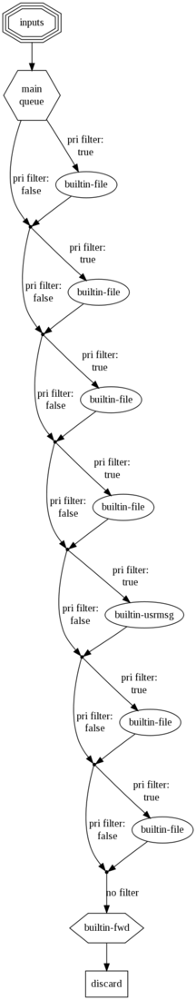
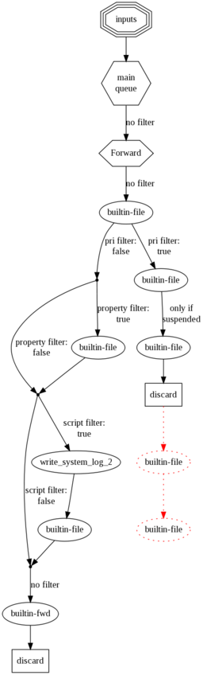

$GenerateConfigGraph
--------------------

**Type:** global configuration parameter

**Default:**

**Available Since:** 4.3.1 **CURRENTLY NOT AVAILABLE**

**Description:**

**This parameter is currently not supported. We had to disable it when
we improved the rule engine. It is considerable effort to re-enable it.
On the other hand, we are about to add a new config system, which will
make yet another config graph method necessary. As such we have decided
to currently disable this functionality and re-introduce it when the new
config system has been instantiated.**

This parameter permits to create (hopefully) good-looking visualizations
of rsyslogd's configuration. It does not affect rsyslog operation. If
the parameter is specified multiple times, all but the last are ignored.
If it is specified, a graph is created. This happens both during a
regular startup as well a config check run. It is recommended to include
this parameter only for documentation purposes and remove it from a
production configuration.

The graph is not drawn by rsyslog itself. Instead, it uses the great
open source tool `Graphviz <http://www.graphviz.org>`_ to do the actual
drawing. This has at least two advantages:

-  the graph drawing support code in rsyslog is extremely slim and
   without overhead
-  the user may change or further annotate the generated file, thus
   potentially improving his documentation

The drawback, of course, is that you need to run Graphviz once you have
generated the control file with rsyslog. Fortunately, the process to do
so is rather easy:

#. add "$GenerateConfigGraph /path/to/file.dot" to rsyslog.conf (from
   now on, I will call the file just file.dot). Optionally, add
   "$ActionName" statement **in front of** those actions that you like
   to use friendly names with. If you do this, keep the names short.
#. run rsyslog at least once (either in regular or configuration check
   mode)
#. remember to remove the $GenerateConfigGraph parameter when you no
   longer need it (or comment it out)
#. change your working directory to where you place the dot file
#. if you would like to edit the rsyslog-generated file, now is the time
   to do so
#. do "dot -Tpng file.dot > file.png"
#. remember that you can use "convert -resize 50% file.png resized.png"
   if dot's output is too large (likely) or too small. Resizing can be
   especially useful if you intend to get a rough overview over your
   configuration.

After completing these steps, you should have a nice graph of your
configuration. Details are missing, but that is exactly the point. At
the start of the graph is always (at least in this version, could be
improved) a node called "inputs" in a triple hexagon shape. This
represents all inputs active in the system (assuming you have defined
some, what the current version does not check). Next comes the main
queue. It is given in a hexagon shape. That shape indicates that a queue
is present and used to de-couple the inbound from the outbound part of
the graph. In technical terms, here is a threading boundary. Action with
"real" queues (other than in direct mode) also utilize this shape. For
actions, notice that a "hexagon action" creates a deep copy of the
message. As such, a "discard hexagon action" actually does nothing,
because it duplicates the message and then discards **the duplicate**.
At the end of the diagram, you always see a "discard" action. This
indicates that rsyslog discards messages which have been run through all
available rules.

Edges are labeled with information about when they are taken. For
filters, the type of filter, but not any specifics, are given. It is
also indicated if no filter is applied in the configuration file (by
using a "\*.\*" selector). Edges without labels are unconditionally
taken. The actions themselves are labeled with the name of the output
module that handles them. If provided, the name given via "ActionName"
is used instead. No further details are provided.

If there is anything in red, this should draw your attention. In this
case, rsyslogd has detected something that does not look quite right. A
typical example is a discard action which is followed by some other
actions in an action unit. Even though something may be red, it can be
valid - rsyslogd's graph generator does not yet check each and every
specialty, so the configuration may just cover a very uncommon case.

Now let's look at some examples. The graph below was generated on a
fairly standard Fedora rsyslog.conf file. It had only the usually
commented-out last forwarding action activated:

   rsyslog configuration graph for a default fedora rsyslog.conf

This is the typical structure for a simple rsyslog configuration. There
are a couple of actions, each guarded by a filter. Messages run from top
to bottom and control branches whenever a filter evaluates to true. As
there is no discard action, all messages will run through all filters
and discarded in the system default discard action right after all
configured actions.

A more complex example can be seen in the next graph. This is a
configuration I created for testing the graph-creation features, so it
contains a little bit of everything. However, real-world configurations
can look quite complex, too (and I wouldn't say this one is very
complex):

Here, we have a user-defined discard action. You can immediately see
this because processing branches after the first "builtin-file" action.
Those messages where the filter evaluates to true for will never run
through the left-hand action branch. However, there is also a
configuration error present: there are two more actions (now shown red)
after the discard action. As the message is discarded, these will never
be executed. Note that the discard branch contains no further filters.
This is because these actions are all part of the same action unit,
which is guarded only by an entry filter. The same is present a bit
further down at the node labeled "write\_system\_log\_2". This note has
one more special feature, that is label was set via "ActionName", thus
is does not have standard form (the same happened to the node named
"Forward" right at the top of the diagram. Inside this diagram, the
"Forward" node is executed asynchronously on its own queue. All others
are executed synchronously.

Configuration graphs are useful for documenting a setup, but are also a
great `troubleshooting <troubleshoot.html>`_ resource. It is important
to remember that **these graphs are generated from rsyslogd's in-memory
action processing structures**. You can not get closer to understanding
on how rsyslog interpreted its configuration files. So if the graph does
not look what you intended to do, there is probably something wrong in
rsyslog.conf.

If something is not working as expected, but you do not spot the error
immediately, I recommend to generate a graph and zoom it so that you see
all of it in one great picture. You may not be able to read anything,
but the structure should look good to you and so you can zoom into those
areas that draw your attention.

**Sample:**

``$DirOwner /path/to/graphfile-file.dot``
