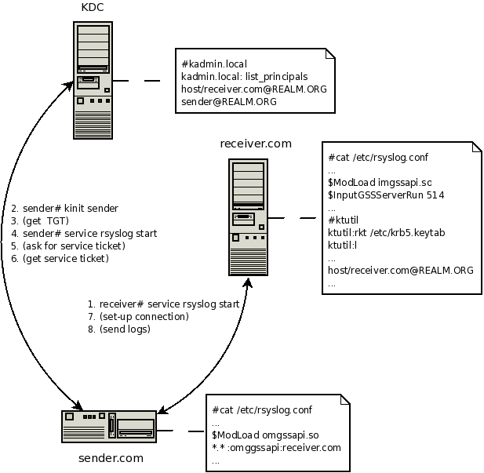

*************************************
omgssapi: GSSAPI Syslog Output Module
*************************************

Purpose
=======

What is it good for
-------------------

-  Client-server authentication
-  Log messages encryption

Requirements
------------

-  Kerberos infrastructure
-  rsyslog, rsyslog-gssapi

Configuration
=============

Let's assume there are 3 machines in Kerberos Realm:

-  The first is running KDC (Kerberos Authentication Service and Key
   Distribution Center),
-  The second is a client sending its logs to the server,
-  The third is receiver, gathering all logs.

1. KDC:

   -  Kerberos database must be properly set-up on KDC machine first. Use
      kadmin/kadmin.local to do that. Two principals need to be added in our
      case:

      #. sender@REALM.ORG

         -  client must have ticket for principal sender
         -  REALM.ORG is Kerberos Realm

      #. host/receiver.mydomain.com@REALM.ORG - service principal

   -  Use ktadd to export service principal and transfer it to
      /etc/krb5.keytab on receiver

#. CLIENT:

   -  set-up rsyslog, in ``/etc/rsyslog.conf``:

      -  ``$ModLoad omgssapi`` - load output GSS module
      -  ``$GSSForwardServiceName otherThanHost`` - set the name of service
         principal, "host" is the default one
      -  ``*.* :omgssapi:receiver.mydomain.com`` - action line, forward logs to
         receiver

   -  ``kinit root`` - get the TGT ticket
   -  ``service rsyslog start``

#. SERVER:

   -  set-up rsyslog, in /etc/rsyslog.conf:

      -  ``$ModLoad imgssapi`` - load input GSS module
      -  ``$InputGSSServerServiceName otherThanHost`` - set the name of service
         principal, "host" is the default one
      -  ``$InputGSSServerPermitPlainTCP on`` - accept GSS and TCP connections
         (not authenticated senders), off by default
      -  ``$InputGSSServerRun 514`` - run server on port

   -  ``service rsyslog start``

The picture demonstrate how things work.

   rsyslog GSSAPI support

Configuration Parameters
========================

.. note::

   Parameter names are case-insensitive; camelCase is recommended for readability.

Module Parameters
-----------------

.. list-table::
   :widths: 30 70
   :header-rows: 1

   * - Parameter
     - Summary
   * - :ref:`param-omgssapi-gssforwardservicename`
     - .. include:: ../../reference/parameters/omgssapi-gssforwardservicename.rst
        :start-after: .. summary-start
        :end-before: .. summary-end
   * - :ref:`param-omgssapi-gssmode`
     - .. include:: ../../reference/parameters/omgssapi-gssmode.rst
        :start-after: .. summary-start
        :end-before: .. summary-end
   * - :ref:`param-omgssapi-actiongssforwarddefaulttemplate`
     - .. include:: ../../reference/parameters/omgssapi-actiongssforwarddefaulttemplate.rst
        :start-after: .. summary-start
        :end-before: .. summary-end

Action Parameters
-----------------

The ``omgssapi`` action is configured via module parameters. In modern
``action()`` syntax, it takes a ``target`` parameter and can optionally have a ``template`` assigned.

Legacy ``:omgssapi:`` syntax is also supported and includes options for
compression and TCP framing. These are specified in parentheses after the
selector, for example ``:omgssapi:(z5,o)hostname``.

-  **z[0-9]**: Enables zlib compression. The optional digit specifies the
   compression level (0-9). Defaults to 9 if no digit is given.
-  **o**: Enables octet-counted TCP framing.

.. toctree::
   :hidden:

   ../../reference/parameters/omgssapi-gssforwardservicename
   ../../reference/parameters/omgssapi-gssmode
   ../../reference/parameters/omgssapi-actiongssforwarddefaulttemplate

