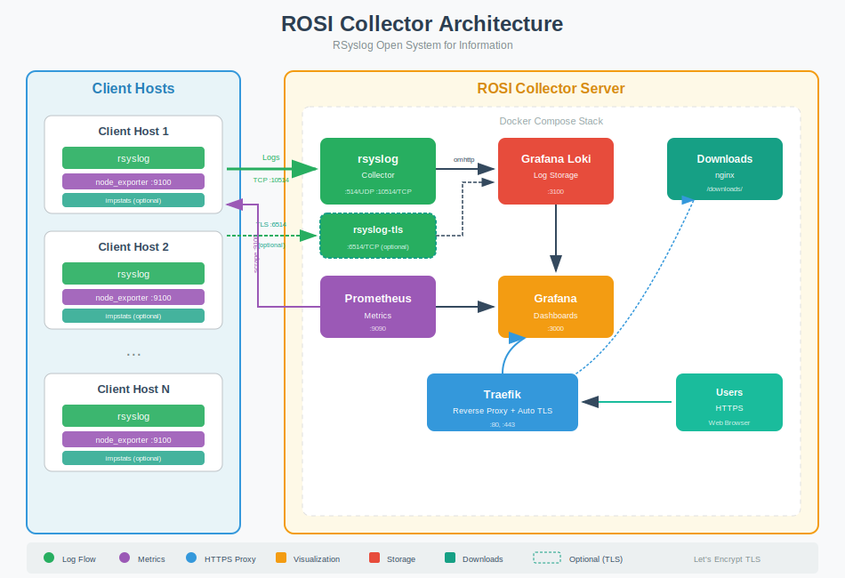

.. _rosi-collector-index:

ROSI Collector
==============

.. index::
   single: ROSI
   single: ROSI Collector
   single: centralized logging
   single: Loki
   single: Grafana

**RSyslog Open System for Information** (ROSI) Collector is a production-ready
centralized log collection and monitoring stack. It combines rsyslog's powerful
log processing with modern observability tools to provide a complete logging
solution.

   
   ROSI Collector architecture - centralized logging with rsyslog, Loki, and Grafana

What is ROSI Collector?
-----------------------

ROSI Collector is a Docker Compose stack that deploys:

- **rsyslog** - High-performance log receiver and processor
- **Grafana Loki** - Log aggregation and querying
- **Grafana** - Visualization with pre-built dashboards
- **Prometheus** - Metrics collection and alerting
- **Traefik** - Reverse proxy with automatic TLS

Together, these components provide centralized log management for any number
of client hosts, with powerful search, visualization, and alerting capabilities.

Use Cases
---------

ROSI Collector is ideal for:

- **Centralized log aggregation** from multiple servers and applications
- **Security monitoring** with searchable audit logs
- **Compliance requirements** needing log retention and search
- **DevOps teams** wanting quick visibility into system logs
- **Small to medium deployments** with up to hundreds of hosts

Key Features
------------

**Pre-built Dashboards**
   Five Grafana dashboards included: Syslog Explorer, Syslog Deep Dive,
   Node Overview, Client Health, and Alerting Overview.

**Automatic TLS**
   Traefik obtains Let's Encrypt certificates automatically. No manual
   certificate management required.

**Easy Client Setup**
   One-line installation scripts for adding new client hosts.

**Prometheus Metrics**
   Collect system metrics from all clients via node_exporter.

**Alerting Ready**
   Email alerting configured and ready to enable.

Quick Start
-----------

1. **Clone the repository** and navigate to the deployment::

      cd rsyslog/deploy/docker-compose/rosi-collector
      
2. **Configure environment**::

      cp .env.template .env
      nano .env
      
   Set at minimum:
   
   - ``TRAEFIK_DOMAIN`` - Your domain (e.g., ``logs.example.com``)
   - ``TRAEFIK_EMAIL`` - Email for Let's Encrypt
   - ``GRAFANA_ADMIN_PASSWORD`` - Admin password

3. **Start the stack**::

      docker compose up -d
      
4. **Access Grafana** at ``https://grafana.your-domain.com``

5. **Configure clients** - see :doc:`client_setup`

For detailed installation instructions, see :doc:`installation`.

Architecture Overview
---------------------

.. code-block:: text

   Client Hosts                    ROSI Collector Server
   ┌────────────┐                 ┌─────────────────────────────────┐
   │  rsyslog   │──TCP:10514────▶ │  rsyslog  ──────────────▶  Loki │
   │            │                 │                                 │
   │node_exporter│◀─────────────── │  Prometheus                     │
   └────────────┘   scrape:9100   │       │                         │
                                  │       ▼                         │
                                  │    Grafana  ◀── Traefik (TLS)   │
                                  └─────────────────────────────────┘

Data flows:

1. **Logs**: Client rsyslog → Collector rsyslog → Loki → Grafana
2. **Metrics**: Prometheus scrapes node_exporter on clients → Grafana

All external access goes through Traefik, which handles TLS termination.

Documentation Contents
----------------------

.. toctree::
   :maxdepth: 1
   :caption: ROSI Collector Guide

   architecture
   installation
   client_setup
   grafana_dashboards
   troubleshooting

See Also
--------

- :doc:`../../containers/collector` - The base collector container image
- :doc:`../../tutorials/reliable_forwarding` - Reliable log forwarding concepts
- :doc:`../../configuration/index` - rsyslog configuration reference
