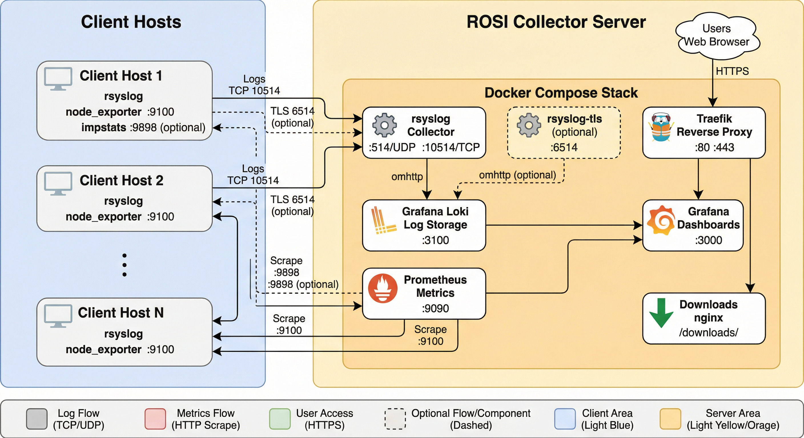
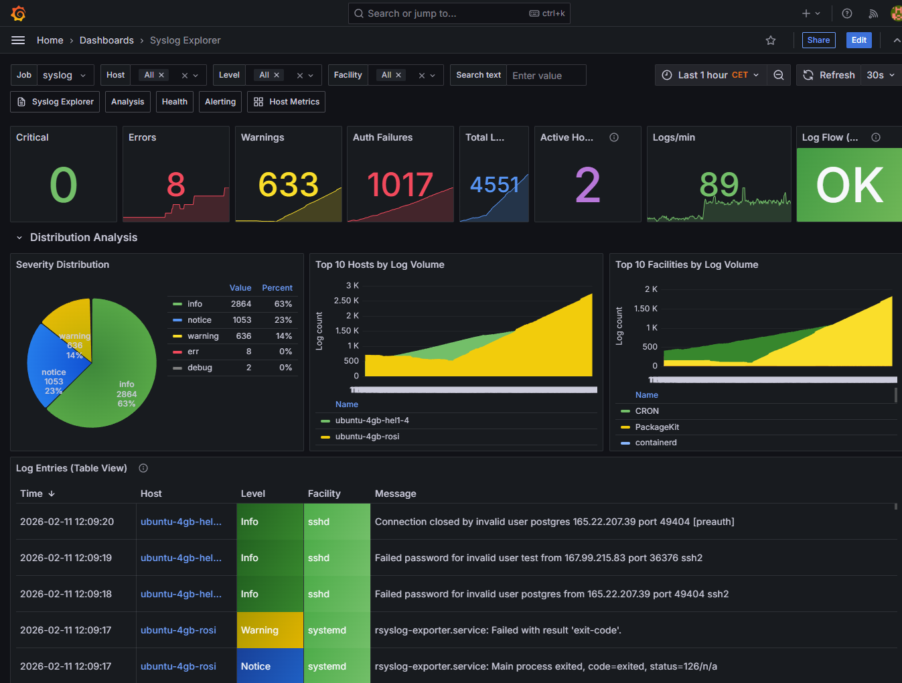

.. _tutorial-deploy-rsyslog-rosi-stack:

.. meta::
   :description: Step-by-step tutorial for deploying a private ROSI Collector stack for centralized logs and metrics across Linux servers or VMs.
   :keywords: rsyslog, ROSI Collector, Loki, Grafana, Prometheus, tutorial, centralized logging, observability

.. summary-start

Learn how to deploy ROSI Collector, connect client systems, view logs and
metrics in Grafana, and troubleshoot common issues without depending on a
specific hosting provider.

.. summary-end

Tutorial: Deploy a Private, Centralized Observability Stack with ROSI Collector
===============================================================================

Introduction
------------

Managing logs and metrics across multiple Linux servers or VMs is difficult
without centralized observability. ROSI (Rsyslog Operations Stack Initiative)
Collector provides a self-hosted stack for centralized log aggregation and
monitoring based on rsyslog, Loki, Grafana, and Prometheus.

This tutorial walks through a practical deployment of ROSI Collector, shows how
to configure client systems, and explains how to use the included Grafana
dashboards.

Key benefits:

- Self-hosted deployment with full control over log data
- Lower resource footprint than heavier observability stacks
- Pre-built dashboards and optional TLS or mTLS support
- Centralized aggregation for logs and host metrics from multiple systems

Prerequisites
-------------

- One Linux server or VM for the collector (Ubuntu 24.04 recommended and tested)
- Docker Engine 20.10 or later and Docker Compose v2
- Root or sudo access
- Basic familiarity with Linux, Docker, and YAML
- Optional domain name for HTTPS and TLS-based syslog
- Optional additional Linux servers or VMs to act as clients

For a small deployment, start with at least:

- 2 vCPUs
- 4 GB RAM
- 50 GB disk

Architecture Overview
---------------------

ROSI Collector uses a central server that receives logs and metrics from
multiple client systems.

   ROSI Collector architecture.

Components:

1. ``rsyslog`` receives syslog from clients on TCP 10514 or TLS on 6514.
2. ``Loki`` stores and indexes logs.
3. ``Grafana`` provides dashboards and ad hoc log queries.
4. ``Prometheus`` scrapes host and impstats metrics.
5. ``Traefik`` provides HTTPS access.
6. ``node_exporter`` exposes host metrics on each client and optionally on the
   collector.

Network requirements:

- Collector inbound: TCP 80, 443, 10514, and optionally 6514
- Client outbound: TCP 10514 or 6514 to the collector
- Client inbound: TCP 9100 from the collector for ``node_exporter``

Step 1: Deploy ROSI Collector
-----------------------------

Clone the repository and move to the deployment directory:

.. code-block:: bash

   sudo apt update && sudo apt upgrade -y
   sudo apt install -y git curl
   git clone https://github.com/rsyslog/rsyslog.git
   cd rsyslog/deploy/docker-compose/rosi-collector

If this is a fresh server and Docker is not installed yet, run the preparation
script once:

.. code-block:: bash

   sudo ./scripts/install-server.sh

For automated setup:

.. code-block:: bash

   sudo NONINTERACTIVE=1 ./scripts/install-server.sh

Initialize the environment:

.. code-block:: bash

   sudo ./scripts/init.sh

The script prompts for:

- Installation directory, default ``/opt/rosi-collector``
- ``TRAEFIK_DOMAIN`` as a domain name or IP address
- ``TRAEFIK_EMAIL`` for Let's Encrypt notifications
- ``GRAFANA_ADMIN_PASSWORD`` or a generated password
- Optional TLS or mTLS for syslog on port 6514
- Optional forwarding of the collector server's own logs

Non-interactive initialization is also supported:

.. code-block:: bash

   sudo TRAEFIK_DOMAIN=logs.example.com \
        TRAEFIK_EMAIL=admin@example.com \
        ./scripts/init.sh

If ``init.sh`` reports an error, stop there and resolve it before starting the
stack or onboarding clients.

For the full installation flow, available ``.env`` options, and TLS details,
see :doc:`../deployments/rosi_collector/installation`.

Start the stack:

.. code-block:: bash

   cd /opt/rosi-collector
   sudo docker compose up -d

Verify services:

.. code-block:: bash

   sudo docker compose ps
   sudo rosi-monitor status

If a service fails to start, inspect logs:

.. code-block:: bash

   sudo docker compose logs rsyslog
   sudo docker compose logs grafana
   sudo docker compose logs loki

Configure host and cloud firewall rules so the required ports are reachable.
If your provider has a network-level firewall or security-group mechanism,
mirror the same allow rules there.

Step 2: Configure Client Systems
--------------------------------

For Linux clients, download the setup script from the collector:

.. code-block:: bash

   wget https://logs.example.com/downloads/install-rsyslog-client.sh
   chmod +x install-rsyslog-client.sh

Run the script:

.. code-block:: bash

   sudo ./install-rsyslog-client.sh

The script configures rsyslog forwarding, creates the spool directory, tests
the configuration, and restarts rsyslog. It can also install an impstats
sidecar unless you pass ``--no-sidecar``.

Send a test log message:

.. code-block:: bash

   logger "Test message from $(hostname)"

Install ``node_exporter`` on each client if you want host metrics:

.. code-block:: bash

   wget https://logs.example.com/downloads/install-node-exporter.sh
   chmod +x install-node-exporter.sh
   sudo ./install-node-exporter.sh

Verify it:

.. code-block:: bash

   sudo systemctl status node_exporter
   curl http://localhost:9100/metrics | head -5

Add the client as a Prometheus target from the collector:

.. code-block:: bash

   sudo prometheus-target add 198.51.100.1:9100 host=webserver role=web network=internal

If the client also runs the impstats sidecar:

.. code-block:: bash

   sudo prometheus-target add-client 198.51.100.1 host=webserver role=web network=internal

Open client firewall rules for ``node_exporter`` and, if used, the impstats
sidecar so the collector can scrape them.

For manual client configuration, TLS forwarding, Windows guidance, and target
registration details, see :doc:`../deployments/rosi_collector/client_setup`.

Optional: Add Windows systems
~~~~~~~~~~~~~~~~~~~~~~~~~~~~~

If part of your fleet runs on Windows, use
`rsyslog Windows Agent <https://www.rsyslog.com/windows-agent/>`__ as the
Windows-side collector and forwarder into ROSI Collector.

This is the supported path for integrating Windows Event Log data into the
stack. rsyslog itself does not run natively on Windows; for background, see
:doc:`../faq/does-rsyslog-run-under-windows`.

In a mixed environment, the practical model is:

1. Linux systems use the ROSI client scripts described above.
2. Windows systems forward events with rsyslog Windows Agent to the same
   collector endpoint.
3. Grafana then lets you search Linux and Windows-originated logs together in
   the same stack.

For product details and deployment guidance, see:

- :doc:`../deployments/rosi_collector/client_setup`
- `rsyslog Windows Agent manual <https://www.rsyslog.com/download/files/windows-agent-manual/index.rsyslog.html>`__

Step 3: Access Grafana
----------------------

Open Grafana in a browser:

.. code-block:: text

   https://logs.example.com

Or use the collector IP address if you are not using DNS:

.. code-block:: text

   https://203.0.113.10

Log in with:

- Username: ``admin``
- Password: the value shown by ``init.sh`` or stored in ``/opt/rosi-collector/.env``

To inspect the saved password:

.. code-block:: bash

   sudo grep GRAFANA_ADMIN_PASSWORD /opt/rosi-collector/.env

ROSI Collector ships with dashboards such as:

1. Syslog Explorer
2. Syslog Analysis
3. Syslog Health
4. Node Overview
5. Alerting Overview

   Example Grafana dashboards included with ROSI Collector.

As a quick verification step, open ``Syslog Explorer`` and search for the test
message you sent in Step 2. In Grafana Explore, example queries include:

If you also onboard Windows systems with rsyslog Windows Agent, their events
become searchable in the same Grafana views alongside logs from Linux clients.

.. code-block:: text

   {host="webserver"}
   {host=~".+"} |= "error"
   {facility="auth"}

Step 4: Advanced Configuration
------------------------------

Once the basic stack is running, the most common next steps are:

- Enable TLS or mTLS for syslog transport
- Adjust Loki retention for your expected log volume
- Add more clients and assign useful Prometheus labels
- Review firewall rules in both the host OS and any cloud network controls
- Use ``rosi-monitor`` for regular health checks

The canonical details live in the ROSI Collector deployment docs:

- :doc:`../deployments/rosi_collector/installation`
- :doc:`../deployments/rosi_collector/client_setup`
- :doc:`../deployments/rosi_collector/grafana_dashboards`

Step 5: Troubleshooting
-----------------------

Keep the first pass simple:

1. Check stack health with ``sudo rosi-monitor health``.
2. Confirm containers are up with ``sudo docker compose ps``.
3. Verify the client with ``sudo rsyslogd -N1`` and a fresh ``logger`` test
   message.
4. Verify Loki readiness with ``curl http://localhost:3100/ready``.
5. Verify client metrics locally with ``curl http://localhost:9100/metrics``.

For specific failures such as downloads returning ``404``, Grafana access
problems, missing logs, Prometheus scrape failures, TLS issues, or storage
pressure, use :doc:`../deployments/rosi_collector/troubleshooting`.

Conclusion
----------

You now have a private ROSI Collector deployment that centralizes logs and
metrics from multiple systems and makes them available in Grafana.

Next steps:

- Add more client systems
- Enable TLS or mTLS for production syslog transport
- Tune retention and alerting for your environment
- Explore the built-in dashboards and extend them as needed

Provider-specific
-----------------

If you want a provider-focused variant of this tutorial, see the Hetzner
Community version:
`Deploying a Private, Centralized Observability Stack with rsyslog ROSI <https://community.hetzner.com/tutorials/deploy-rsyslog-rosi-stack>`_.

See also
--------

- :doc:`../deployments/rosi_collector/index`
- :doc:`../deployments/rosi_collector/installation`
- :doc:`../deployments/rosi_collector/client_setup`
- :doc:`../deployments/rosi_collector/grafana_dashboards`
- :doc:`../deployments/rosi_collector/troubleshooting`
