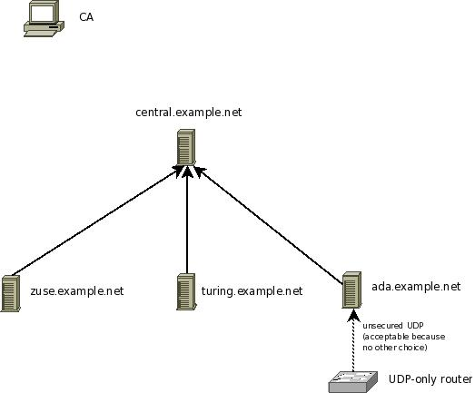

Sample Use Case: Single Central Log Server
==========================================

We have a quite simple use case. There is one central syslog server,
named central.example.net. These server is being reported to by two
Linux machines with name zuse.example.net and turing.example.net. Also,
there is a third client - ada.example.net - which send both its own
messages to the central server but also forwards messages receive from
an UDP-only capable router. We have decided to use ada.example.net
because it is in the same local network segment as the router and so we
enjoy TLS' security benefits for forwarding the router messages inside
the corporate network. All systems (except the router) use
`rsyslog <http://www.rsyslog.com/>`_ as the syslog software.

Please note that the CA must not necessarily be connected to the rest of
the network. Actually, it may be considered a security plus if it is
not. If the CA is reachable via the regular network, it should be
sufficiently secured (firewall rules et al). Keep in mind that if the
CA's security is breached, your overall system security is breached.

In case the CA is compromised, you need to regenerate the CA's
certificate as well as all individual machines certificates.
