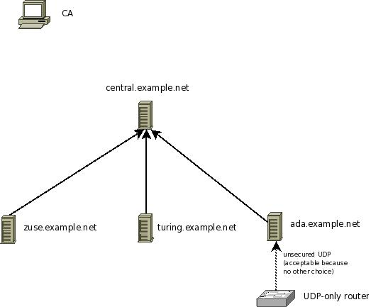

Setting up the Central Server
=============================

In this step, we configure the central server. We assume it accepts
messages only via TLS protected plain tcp based syslog from those peers
that are explicitly permitted to send to it. The picture below show our
configuration. This step configures the server central.example.net.

**Important:** *Keep in mind that the order of configuration directives
is very important in rsyslog. As such, the samples given below do only
work if the given order is preserved. Re-ordering the directives can
break configurations and has broken them in practice. If you intend to
re-order them, please be sure that you fully understand how the
configuration language works and, most importantly, which statements
form a block together. Please also note that we understand the
current configuration file format is ugly. However, there has been more
important work in the way of enhancing it. If you would like to
contribute some time to improve the config file language, please let us
know. Any help is appreciated (be it doc or coding work!).*

Steps to do:

-  make sure you have a functional CA (`Setting up the
   CA <tls_cert_ca.html>`_)
-  generate a machine certificate for central.example.net (follow
   instructions in `Generating Machine
   Certificates <tls_cert_machine.html>`_)
-  make sure you copy over ca.pem, machine-key.pem ad machine-cert.pem
   to the central server. Ensure that no user except root can access
   them (**even read permissions are really bad**).
-  configure the server so that it accepts messages from all machines in
   the example.net domain that have certificates from your CA.
   Alternatively, you may also precisely define from which machine names
   messages are accepted. See sample rsyslog.conf below.

In this setup, we use wildcards to ease adding new systems. We permit
the server to accept messages from systems whose names match
\*.example.net.

::

    PermittedPeer["*.example.net"]

This will match zuse.example.net and turing.example.net, but NOT
pascal.otherdepartment.example.net. If the later would be desired, you
can (and need) to include additional permitted peer config statements:

::

    PermittedPeer["*.example.net","*.otherdepartment.example.net","*.example.com"]

As can be seen with example.com, the different permitted peers need NOT
to be in a single domain tree. Also, individual machines can be
configured. For example, if only zuse, turing and ada should be able to
talk to the server, you can achieve this by:

::

    PermittedPeer["zuse.example.net","turing.example.net","ada.example.net"]

As an extension to the (upcoming) IETF syslog/tls standard, you can
specify some text together with a domain component wildcard. So
"\*server.example.net", "server\*.example.net" are valid permitted
peers. However "server\*Fix.example.net" is NOT a valid wildcard. The
IETF standard permits no text along the wildcards.

The reason we use wildcards in the default setup is that it makes it
easy to add systems without the need to change the central server's
configuration. It is important to understand that the central server
will accept names **only** (no exception) if the client certificate was
signed by the CA we set up. So if someone tries to create a malicious
certificate with a name "zuse.example.net", the server will **not**
accept it. So a wildcard is safe as long as you ensure CA security is
not breached. Actually, you authorize a client by issuing the
certificate to it.

**At this point, please be reminded once again that your security needs
may be quite different from what we assume in this tutorial. Evaluate
your options based on your security needs.**

Sample syslog.conf
~~~~~~~~~~~~~~~~~~

Keep in mind that this rsyslog.conf accepts messages via TCP, only. The
only other source accepted is messages from the server itself. 

::

    module(load="imuxsock") # local messages
    module(load="imtcp" # TCP listener
	StreamDriver.Name="gtls"
	StreamDriver.Mode="1" # run driver in TLS-only mode
	StreamDriver.Authmode="anon"
	)

    # make gtls driver the default and set certificate files
    global(
	DefaultNetstreamDriver="gtls"
	DefaultNetstreamDriverCAFile="/path/to/contrib/gnutls/ca.pem"
        DefaultNetstreamDriverCertFile="/path/to/contrib/gnutls/cert.pem"
        DefaultNetstreamDriverKeyFile="/path/to/contrib/gnutls/key.pem"
	)	

	# start up listener at port 6514
	input(
	type="imtcp"
	port="6514"
	)

**Be sure to safeguard at least the private key (machine-key.pem)!** If
some third party obtains it, you security is broken!
