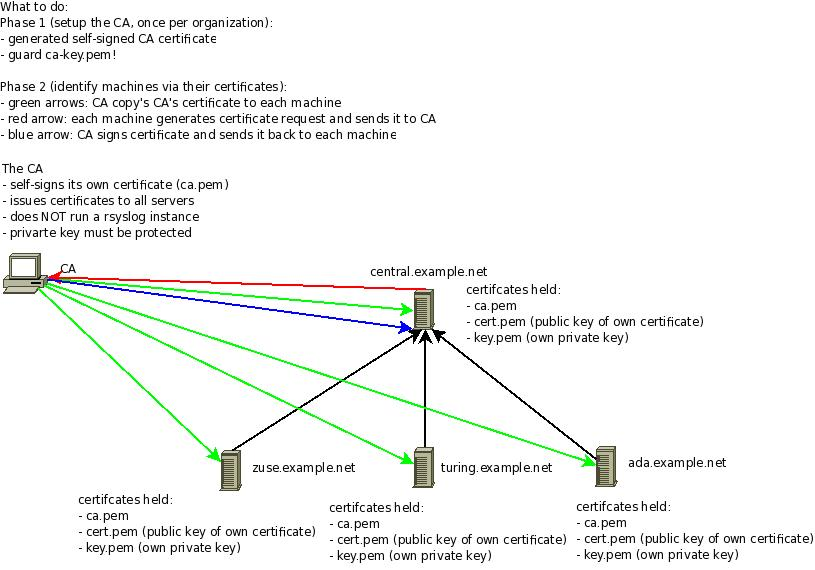

Encrypting Syslog Traffic with TLS (SSL)
========================================

Written by `Rainer Gerhards <https://rainer.gerhards.net/>`_ (2008-07-03)

.. toctree::
   :maxdepth: 1

   tls_cert_scenario
   tls_cert_ca
   tls_cert_machine
   tls_cert_server
   tls_cert_client
   tls_cert_udp_relay
   tls_cert_errmsgs
   tls_cert_script

Overview
--------

This document describes a secure way to set up rsyslog TLS. A secure
logging environment requires more than just encrypting the transmission
channel. This document provides one possible way to create such a secure
system.

Rsyslog's TLS authentication can be used very flexible and thus supports
a wide range of security policies. This section tries to give some
advise on a scenario that works well for many environments. However, it
may not be suitable for you - please assess you security needs before
using the recommendations below. Do not blame us if it doesn't provide
what you need ;)

Our policy offers these security benefits:

-  syslog messages are encrypted while traveling on the wire
-  the syslog sender authenticates to the syslog receiver; thus, the
   receiver knows who is talking to it
-  the syslog receiver authenticates to the syslog sender; thus, the
   sender can check if it indeed is sending to the expected receiver
-  the mutual authentication prevents man-in-the-middle attacks

Our security goals are achieved via public/private key security. As such,
it is vital that private keys are well protected and not accessible to
third parties.

If private keys have become known to third parties, the system does not
provide any security at all. Also, our solution bases on X.509
certificates and a (very limited) chain of trust. We have one instance
(the CA) that issues all machine certificates. The machine certificate
identifies a particular machine. While in theory (and practice), there
could be several "sub-CA" that issues machine certificates for a
specific administrative domain, we do not include this in our "simple yet
secure" setup. If you intend to use this, rsyslog supports it, but then
you need to dig a bit more into the documentation (or use the forum to
ask). In general, if you depart from our simple model, you should have
good reasons for doing so and know quite well what you are doing -
otherwise you may compromise your system security.

Please note that security never comes without effort. In the scenario
described here, we have limited the effort as much as possible. What
remains is some setup work for the central CA, the certificate setup for
each machine as well as a few configuration commands that need to be
applied to all of them. Probably the most important limiting factor in
our setup is that all senders and receivers must support IETF's
syslog-transport-tls standard (which is not finalized yet). We use
mandatory-to-implement technology, yet you may have trouble finding all
required features in some implementations. More often, unfortunately,
you will find that an implementation does not support the upcoming IETF
standard at all - especially in the "early days" (starting May 2008)
when rsyslog is the only implementation of said standard.

Fortunately, rsyslog supports almost every protocol that is out there
in the syslog world. So in cases where transport-tls is not available on
a sender, we recommend to use rsyslog as the initial relay. In that
mode, the not-capable sender sends to rsyslog via another protocol, which
then relays the message via transport-tls to either another interim
relay or the final destination (which, of course, must by transport-tls
capable). In such a scenario, it is best to try see what the sender
support. Maybe it is possible to use industry-standard plain tcp syslog
with it. Often you can even combine it with stunnel, which then, too,
enables a secure delivery to the first rsyslog relay. If all of that is
not possible, you can (and often must...) resort to UDP. Even though
this is now lossy and insecure, this is better than not having the
ability to listen to that device at all. It may even be reasonable secure
if the uncapable sender and the first rsyslog relay communicate via a
private channel, e.g. a dedicated network link.

One final word of caution: transport-tls protects the connection between
the sender and the receiver. It does not necessarily protect against
attacks that are present in the message itself. Especially in a relay
environment, the message may have been originated from a malicious
system, which placed invalid hostnames and/or other content into it. If
there is no provisioning against such things, these records may show up
in the receivers' repository. -transport-tls does not protect against
this (but it may help, properly used). Keep in mind that
syslog-transport-tls provides hop-by-hop security. It does not provide
end-to-end security and it does not authenticate the message itself
(just the last sender).

If you'd like to get all information very rapidly, the graphic below
contains everything you need to know (from the certificate perspective)
in a very condensed manner. It is no surprise if the graphic puzzles
you. In this case, `simply read on <tls_cert_scenario.html>`_ for full
instructions.

Summary
~~~~~~~

If you followed the steps outlined in this documentation set, you now
have

a reasonable (for most needs) secure setup for the following
environment:

.. figure:: tls_cert_100.jpg
   :align: center
   :alt: 

You have learned about the security decisions involved and which we made
in this example. **Be once again reminded that you must make sure
yourself that whatever you do matches your security needs!** There is no
guarantee that what we generally find useful actually is. It may even be
totally unsuitable for your environment.

In the example, we created a rsyslog certificate authority (CA). Guard
the CA's files. You need them whenever you need to create a new machine
certificate. We also saw how to generate the machine certificates
themselves and distribute them to the individual machines. Also, you have
found some configuration samples for a server, a client and a syslog
relay. Hopefully, this will enable you to set up a similar system in
many environments.

Please be warned that you defined some expiration dates for the
certificates. After they are reached, the certificates are no longer
valid and rsyslog will NOT accept them. At that point, syslog messages
will no longer be transmitted (and rsyslogd will heavily begin to
complain). So it is a good idea to make sure that you renew the
certificates before they expire. Recording a reminder somewhere is
probably a good idea.
