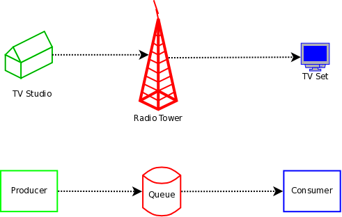
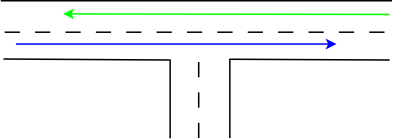
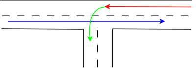
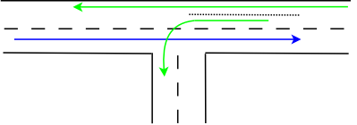
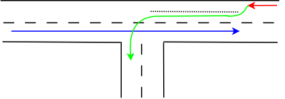
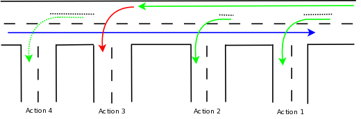
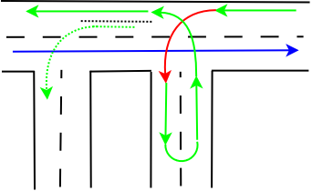
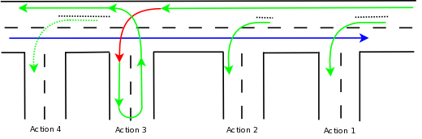

Turning Lanes and Rsyslog Queues
================================

If there is a single object absolutely vital to understanding the way
rsyslog works, this object is queues. Queues offer a variety of
services, including support for multithreading. While there is elaborate
in-depth documentation on the ins and outs of :doc:`rsyslog queues
<../concepts/queues>`, some of the concepts are hard to grasp even for
experienced people. I think this is because rsyslog uses a very high
layer of abstraction which includes things that look quite unnatural,
like queues that do **not** actually queue...

With this document, I take a different approach: I will not describe
every specific detail of queue operation but hope to be able to provide
the core idea of how queues are used in rsyslog by using an analogy. I
will compare the rsyslog data flow with real-life traffic flowing at an
intersection.

But first let's set the stage for the rsyslog part. The graphic below
describes the data flow inside rsyslog:

.. figure:: dataflow.png
   :align: center
   :alt: rsyslog data flow

   rsyslog data flow

Note that there is a `video
tutorial <http://www.rsyslog.com/Article350.phtml>`_ available on the
data flow. It is not perfect, but may aid in understanding this picture.

For our needs, the important fact to know is that messages enter rsyslog
on "the left side" (for example, via UDP), are preprocessed, put
into the so-called main queue, taken off that queue, filtered and are
placed into one or several action queues (depending on filter results).
They leave rsyslog on "the right side" where output modules (like the
file or database writer) consume them.

So there are always **two** stages where a message (conceptually) is
queued - first in the main queue and later on in *n* action specific
queues (with *n* being the number of actions that the message in
question needs to be processed by, what is being decided by the "Filter
Engine"). As such, a message will be in at least two queues during its
lifetime (with the exception of messages being discarded by the queue
itself, but for the purpose of this document, we will ignore that
possibility).

Also, it is vitally important to understand that **each** action has a
queue sitting in front of it. If you have dug into the details of
rsyslog configuration, you have probably seen that a queue mode can be
set for each action. And the default queue mode is the so-called "direct
mode", in which "the queue does not actually enqueue data". That sounds
silly, but is not. It is an important abstraction that helps keep the
code clean.

To understand this, we first need to look at who is the active
component. In our data flow, the active part always sits to the left of
the object. For example, the "Preprocessor" is being called by the
inputs and calls itself into the main message queue. That is, the queue
receiver is called, it is passive. One might think that the "Parser &
Filter Engine" is an active component that actively pulls messages from
the queue. This is wrong! Actually, it is the queue that has a pool of
worker threads, and these workers pull data from the queue and then call
the passively waiting Parser and Filter Engine with those messages. So
the main message queue is the active part, the Parser and Filter Engine
is passive.

Let's now try an analogy for this part: Think about a TV show.
The show is produced in some TV studio, from there sent (actively) to a
radio tower. The radio tower passively receives from the studio and then
actively sends out a signal, which is passively received by your TV set.
In our simplified view, we have the following picture:

   rsyslog queues and TV analogy

The lower part of the picture lists the equivalent rsyslog entities, in
an abstracted way. Every queue has a producer (in the above sample the
input) and a consumer (in the above sample the Parser and Filter
Engine). Their active and passive functions are equivalent to the TV
entities that are listed on top of the rsyslog entity. For example, a
rsyslog consumer can never actively initiate reception of a message in
the same way a TV set cannot actively "initiate" a TV show - both can
only "handle" (display or process) what is sent to them.

Now let's look at the action queues: here, the active part, the
producer, is the Parser and Filter Engine. The passive part is the
Action Processor. The latter does any processing that is necessary to
call the output plugin, in particular it processes the template to
create the plugin calling parameters (either a string or vector of
arguments). From the action queue's point of view, Action Processor and
Output form a single entity. Again, the TV set analogy holds. The Output
**does not** actively ask the queue for data, but rather passively waits
until the queue itself pushes some data to it.

Armed with this knowledge, we can now look at the way action queue modes
work. My analogy here is a junction, as shown below (note that the
colors in the pictures below are **not** related to the colors in the
pictures above!):

This is a very simple real-life traffic case: one road joins another. We
look at traffic on the straight road, here shown by blue and green
arrows. Traffic in the opposing direction is shown in blue. Traffic
flows without any delays as long as nobody takes turns. To be more
precise, if the opposing traffic takes a (right) turn, traffic still
continues to flow without delay. However, if a car in the red traffic
flow intends to do a (left, then) turn, the situation changes:

The turning car is represented by the green arrow. It cannot turn unless
there is a gap in the "blue traffic stream". And as this car blocks the
roadway, the remaining traffic (now shown in red, which should indicate
the block condition), must wait until the "green" car has made its turn.
So a queue will build up on that lane, waiting for the turn to be
completed. Note that in the examples below I do not care that much about
the properties of the opposing traffic. That is, because its structure
is not really important for what I intend to show. Think about the blue
arrow as being a traffic stream that most of the time blocks
left-turners, but from time to time has a gap that is sufficiently large
for a left-turn to complete.

Our road network designers know that this may be unfortunate, and for
more important roads and junctions, they came up with the concept of
turning lanes:

Now, the car taking the turn can wait in a special area, the turning
lane. As such, the "straight" traffic is no longer blocked and can flow
in parallel to the turning lane (indicated by a now-green-again arrow).

However, the turning lane offers only finite space. So if too many cars
intend to take a left turn, and there is no gap in the "blue" traffic,
we end up with this well-known situation:

The turning lane is now filled up, resulting in a tailback of cars
intending to left turn on the main driving lane. The end result is that
"straight" traffic is again being blocked, just as in our initial
problem case without the turning lane. In essence, the turning lane has
provided some relief, but only for a limited amount of cars. Street
system designers now try to weight cost vs. benefit and create (costly)
turning lanes that are sufficiently large to prevent traffic jams in
most, but not all cases.

**Now let's dig a bit into the mathematical properties of turning
lanes.** We assume that cars all have the same length. So, units of
cars, the length is always one (which is nice, as we don't need to care
about that factor any longer ;)). A turning lane has finite capacity of
*n* cars. As long as the number of cars wanting to take a turn is less
than or equal to *n*, "straight traffic" is not blocked (or the other way
round, traffic is blocked if at least *n + 1* cars want to take a
turn!). We can now find an optimal value for *n*: it is a function of
the probability that a car wants to turn and the cost of the turning
lane (as well as the probability there is a gap in the "blue" traffic,
but we ignore this in our simple sample). If we start from some finite
upper bound of *n*, we can decrease *n* to a point where it reaches
zero. But let's first look at *n = 1*, in which case exactly one car can
wait on the turning lane. More than one car, and the rest of the traffic
is blocked. Our everyday logic indicates that this is actually the
lowest boundary for *n*.

In an abstract view, however, *n* can be zero and that works nicely.
There still can be *n* cars at any given time on the turning lane, it
just happens that this means there can be no car at all on it. And, as
usual, if we have at least *n + 1* cars wanting to turn, the main
traffic flow is blocked. True, but *n + 1 = 0 + 1 = 1* so as soon as
there is any car wanting to take a turn, the main traffic flow is
blocked (remember, in all cases, I assume no sufficiently large gaps in
the opposing traffic).

This is the situation our everyday perception calls "road without
turning lane". In my math model, it is a "road with turning lane of size
0". The subtle difference is important: my math model guarantees that,
in an abstract sense, there always is a turning lane, it may just be too
short. But it exists, even though we don't see it. And now I can claim
that even in my small home village, all roads have turning lanes, which
is rather impressive, isn't it? ;)

**And now we finally have arrived at rsyslog's queues!** Rsyslog action
queues exists for all actions just like all roads in my village have
turning lanes! And as in this real-life sample, it may be hard to see
the action queues for that reason. In rsyslog, the "direct" queue mode
is the equivalent to the 0-sized turning lane. And actions queues are
the equivalent to turning lanes in general, with our real-life *n* being
the maximum queue size. The main traffic line (which sometimes is
blocked) is the equivalent to the main message queue. And the periods
without gaps in the opposing traffic are equivalent to execution time of
an action. In a rough sketch, the rsyslog main and action queues look
like in the following picture.

We need to read this picture from right to left (otherwise I would need
to redo all the graphics ;)). In action 3, you see a 0-sized turning
lane, aka an action queue in "direct" mode. All other queues are run in
non-direct modes, but with different sizes greater than 0.

Let us first use our car analogy: Assume we are in a car on the main
lane that wants to take turn into the "action 4" road. We pass action 1,
where a number of cars wait in the turning lane and we pass action 2,
which has a slightly smaller, but still not filled up turning lane. So
we pass that without delay, too. Then we come to "action 3", which has
no turning lane. Unfortunately, the car in front of us wants to turn
left into that road, so it blocks the main lane. So, this time we need
to wait. An observer standing on the sidewalk may see that while we need
to wait, there are still some cars in the "action 4" turning lane. As
such, even though no new cars can arrive on the main lane, cars still
turn into the "action 4" lane. In other words, an observer standing in
"action 4" road is unable to see that traffic on the main lane is
blocked.

Now on to rsyslog: Other than in the real-world traffic example,
messages in rsyslog can - at more or less the same time - "take turns"
into several roads at once. This is done by duplicating the message if
the road has a non-zero-sized "turning lane" - or in rsyslog terms a
queue that is running in any non-direct mode. If so, a deep copy of the
message object is made, that placed into the action queue and then the
initial message proceeds on the "main lane". The action queue then
pushes the duplicates through action processing. This is also the reason
why a discard action inside a non-direct queue does not seem to have an
effect. Actually, it discards the copy that was just created, but the
original message object continues to flow.

In action 1, we have some entries in the action queue, as we have in
action 2 (where the queue is slightly shorter). As we have seen, new
messages pass action one and two almost instantaneously. However, when a
messages reaches action 3, its flow is blocked. Now, message processing
must wait for the action to complete. Processing flow in a direct mode
queue is something like a U-turn:

   message processing in an rsyslog action queue in direct mode

The message starts to execute the action and once this is done,
processing flow continues. In a real-life analogy, this may be the route
of a delivery man who needs to drop a parcel in a side street before he
continues driving on the main route. As a side-note, think of what
happens with the rest of the delivery route, at least for today, if the
delivery truck has a serious accident in the side street. The rest of
the parcels won't be delivered today, will they? This is exactly how the
discard action works. It drops the message object inside the action and
thus the message will no longer be available for further delivery - but
as I said, only if the discard is done in a direct mode queue (I am
stressing this example because it often causes a lot of confusion).

Back to the overall scenario. We have seen that messages need to wait
for action 3 to complete. Does this necessarily mean that at the same
time no messages can be processed in action 4? Well, it depends. As in
the real-life scenario, action 4 will continue to receive traffic as
long as its action queue ("turn lane") is not drained. In our drawing,
it is not. So action 4 will be executed while messages still wait for
action 3 to be completed.

Now look at the overall picture from a slightly different angle:

   message processing in an rsyslog action queue in direct mode

The number of all connected green and red arrows is four - one each for
action 1, 2 and 4 (this one is dotted as action 4 was a special case)
and one for the "main lane" as well as action 3 (this one contains the
sole red arrow). **This number is the lower bound for the number of
threads in rsyslog's output system ("right-hand part" of the main
message queue)!** Each of the connected arrows is a continuous thread
and each "turn lane" is a place where processing is forked onto a new
thread. Also, note that in action 3 the processing is carried out on the
main thread, but not in the non-direct queue modes.

I have said this is "the lower bound for the number of threads...". This
is with good reason: the main queue may have more than one worker thread
(individual action queues currently do not support this, but could do in
the future - there are good reasons for that, too but exploring why
would finally take us away from what we intend to see). Note that you
configure an upper bound for the number of main message queue worker
threads. The actual number varies depending on a lot of operational
variables, most importantly the number of messages inside the queue. The
number *t\_m* of actually running threads is within the integer-interval
[0,confLimit] (with confLimit being the operator configured limit, which
defaults to 5). Output plugins may have more than one thread created by
themselves. It is quite unusual for an output plugin to create such
threads and so I assume we do not have any of these. Then, the overall
number of threads in rsyslog's filtering and output system is *t\_total
= t\_m + number of actions in non-direct modes*. Add the number of
inputs configured to that and you have the total number of threads
running in rsyslog at a given time (assuming again that inputs utilize
only one thread per plugin, a not-so-safe assumption).

A quick side-note: I gave the lower bound for *t\_m* as zero, which is
somewhat in contrast to what I wrote at the beginning of the last paragraph.
Zero is actually correct, because rsyslog stops all worker threads when
there is no work to do. This is also true for the action queues. So the
ultimate lower bound for a rsyslog output system without any work to
carry out actually is zero. But this bound will never be reached when
there is continuous flow of activity. And, if you are curious: if the
number of workers is zero, the worker wakeup process is actually handled
within the threading context of the "left-hand-side" (or producer) of
the queue. After being started, the worker begins to play the active
queue component again. All of this, of course, can be overridden with
configuration directives.

When looking at the threading model, one can simply add n lanes to the
main lane but otherwise retain the traffic analogy. This is a very good
description of the actual process (think what this means to the "turning
lanes"; hint: there still is only one per action!).

**Let's try to do a warp-up:** I have hopefully been able to show that
in rsyslog, an action queue "sits in front of" each output plugin.
Messages are received and flow, from input to output, over various
stages and two level of queues to the outputs. Actions queues are always
present, but may not easily be visible when in direct mode (where no
actual queuing takes place). The "road junction with turning lane"
analogy well describes the way - and intent - of the various queue
levels in rsyslog.

On the output side, the queue is the active component, **not** the
consumer. As such, the consumer cannot ask the queue for anything (like
n number of messages) but rather is activated by the queue itself. As
such, a queue somewhat resembles a "living thing" whereas the outputs
are just tools that this "living thing" uses.

**Note that I left out a couple of subtleties**, especially when it
comes to error handling and terminating a queue (you hopefully have now
at least a rough idea why I say "terminating **a queue**" and not
"terminating an action" - *who is the "living thing"?*). An action
returns a status to the queue, but it is the queue that ultimately
decides which messages can finally be considered processed and which
not. Please note that the queue may even cancel an output right in the
middle of its action. This happens, if configured, if an output needs
more than a configured maximum processing time and is a guard condition
to prevent slow outputs from deferring a rsyslog restart for too long.
Especially in this case re-queuing and cleanup is not trivial. Also,
note that I did not discuss disk-assisted queue modes. The basic rules
apply, but there are some additional constraints, especially in regard
to the threading model. Transitioning between actual disk-assisted mode
and pure-in-memory-mode (which is done automatically when needed) is
also far from trivial and a real joy for an implementer to work on ;).

If you have not done so before, it may be worth reading
:doc:`Understanding rsyslog Queues <../concepts/queues>`, which most
importantly lists all the knobs you can turn to tweak queue operation.

.. _concept-model-whitepapers-queues_analogy:

Conceptual model
----------------

- rsyslog message flow mirrors traffic: the main queue drives processing and pushes work to passive consumers.
- Every action conceptually has a queue; "direct" mode is equivalent to a zero-capacity turning lane that still gates flow.
- Non-direct queues duplicate messages for parallel delivery, isolating slow actions from the main path.
- Queue workers are the active agents pulling from queues and invoking parsers or actions; consumers never request data.
- Queue capacity and worker counts bound concurrency: more lanes/queues increase parallelism, while zero-capacity queues serialize.
- Shutdown, error handling, and timeouts are governed by the queue, which decides completion and can cancel long-running actions.
