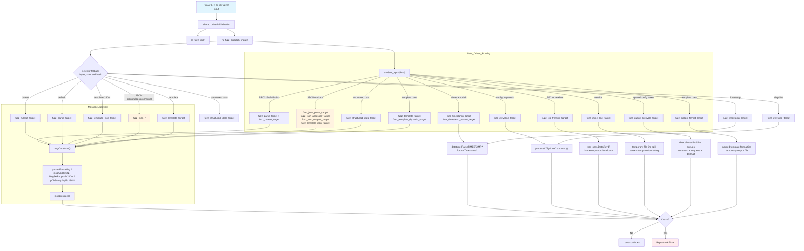

## Description

- File mode, AFL++ persistent mode, and libFuzzer use the same dispatcher and
  iteration reset path.
- Initialization happens once; each testcase can reach multiple subsystems
  based on its contents, including parser/ruleset, JSON, structured data,
  templates, timestamps, TCP framing, queues, imfile-like line processing,
  action formatting, and legacy configuration commands.
- Four byte/length selectors plus a deterministic hash keep target selection
  diverse for inputs without recognizable syntax.
- `msgConstruct`/`msgDestruct` wrap each target to avoid leaks/double-frees; datetime formatting and cfsysline parsing are driven in isolation.
- Runs under AFL++ persistent mode for fast iterations.
